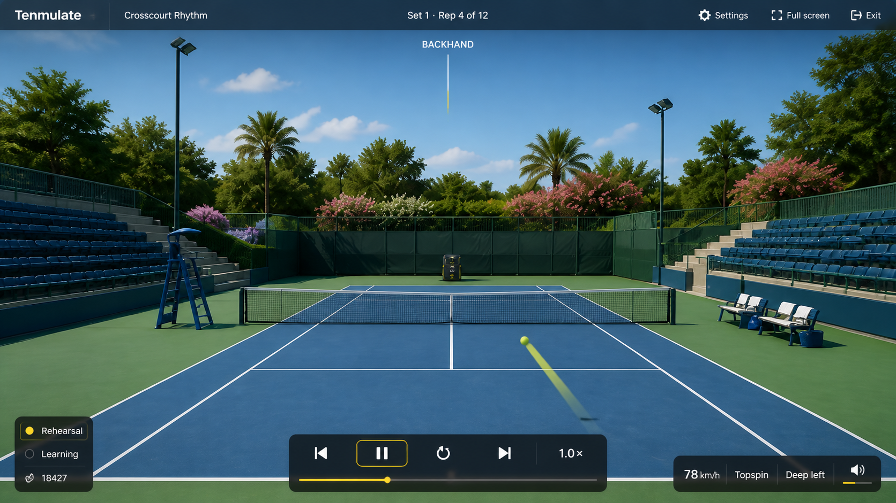
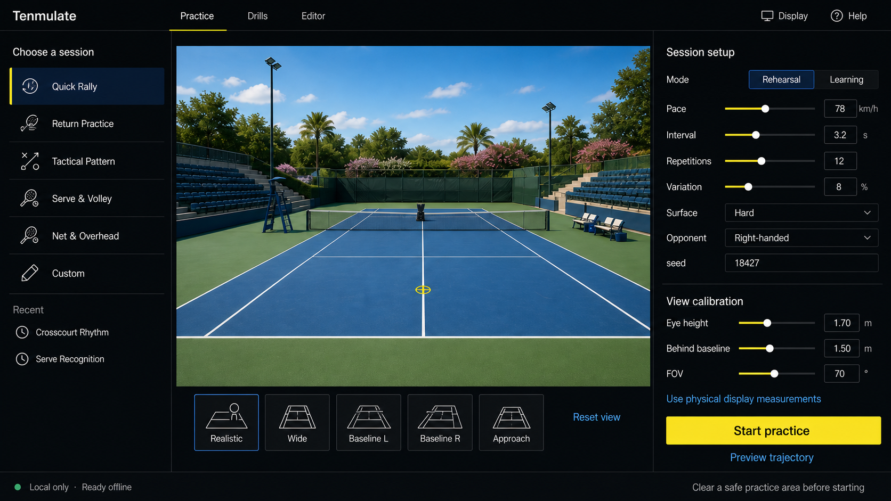
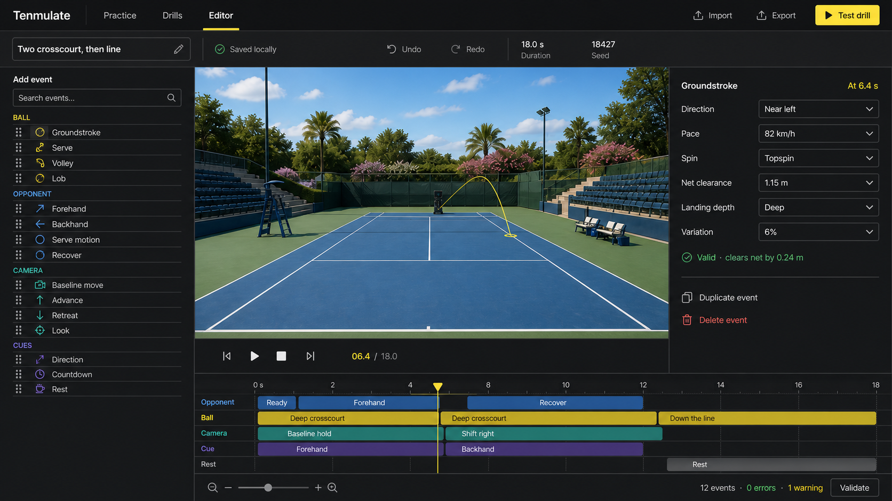

# Tenmulate application UI concepts

- **Status:** Implementation reference; owner refinement remains welcome
- **Generated:** 2026-08-29 with the built-in OpenAI image-generation tool
- **Scope:** Practice setup, active rehearsal, and local timeline editor
- **Native review size:** 1920 × 1080, 16:9

The product is a quiet sports instrument, not a game menu wrapped around a court. The live court is always the primary visual surface; configuration chrome is compact, dark, and structurally consistent across routes.

## Primary rehearsal

The active repetition minimizes controls and preserves the opponent/ball corridor. The temporary opponent is a procedural ball machine. The top rail reports drill/session state, the bottom transport handles playback, and small corner readouts expose mode and the current shot without covering the bounce area.

## Practice setup and calibration

Setup uses three open rails: session family, live Three.js preview, and session/view inspector. Camera presets sit beneath the preview. The primary action remains visible without turning the screen into a card grid.

## Timeline editor

The editor keeps the same header and court preview, adds an event library and property inspector, then gives the bottom third to five deterministic tracks: opponent, ball, camera, cue, and rest.

## Design system

### Tokens

| Role | Token |
| --- | --- |
| App background | `#080c0f` |
| Elevated/open rail | `#0d1419` / `rgba(8, 15, 20, 0.88)` |
| Selected blue | `#0d2943` |
| Primary text | `#f4f7f8` |
| Secondary text | `#9aa8b2` |
| Divider | `#25313a` |
| Tennis accent | `#f2df21` |
| Interaction blue | `#4aa8ff` |
| Valid | `#49c985` |
| Warning | `#e6ad3a` |
| Error | `#ef6b62` |
| Radius | 6, 8, and 10 px; avoid oversized capsules |
| Motion | 120 ms controls, 220 ms panels, physically bounded camera paths |

Use `Inter`/system sans for chrome with tabular numerals. Headings are restrained; labels and control values are deliberately sized rather than browser defaults. Hairline borders and open dividers carry most of the structure.

### Component families

- `AppHeader`: wordmark, Practice/Drills/Editor routes, context actions.
- `SessionRail`: icon-led list rows, selected rule/surface, recent drills.
- `SceneViewport`: long-lived Three.js canvas, loading/error overlay, optional trajectory/debug layers.
- `Inspector`: grouped native inputs, sliders plus numeric fields, validation messages.
- `Transport`: previous, play/pause, restart/stop, next, playback speed, scrub position.
- `Timeline`: time ruler, five typed tracks, playhead, clips, zoom and validation summary.
- `RehearsalHud`: repetition status, preparation cue, mode/seed, current resolved-shot readout.
- `Dialog/Drawer`: safety gate, physical-display calibration, import errors, completion summary.

### Icon inventory

Use one 1.75–2 px round-cap outline family for settings, full screen, exit, transport, volume, session families, display, help, import/export, undo/redo, drag handles, validation, duplicate, delete, and zoom. Icons require accessible names; text glyphs are not substitutes.

## Allowed primary-screen copy

The implementation may use the concept copy plus state-dependent equivalents required by the PRD: drill name, set/repetition, shot direction, resolved pace/spin/depth, mode, seed, countdown, pause/restart/exit, full screen, settings, volume, and completion summary. No marketing claims, score, avatar/account, premium labels, or decorative status badges belong over the court.

## Responsive behavior

- **≥ 1280 px:** full three-rail setup/editor and full rehearsal HUD.
- **900–1279 px:** narrower rails; inspector becomes an overlay drawer when the court would fall below a usable 16:9 area.
- **< 900 px:** configuration remains usable as stacked route panels, but rehearsal shows an explicit large-display recommendation. V1 does not promise physical shadow-swing use on a phone.
- Full-screen rehearsal hides the application header and nonessential HUD after inactivity; pointer, keyboard, or pause restores it.
- `prefers-reduced-motion` selects cut/gentle camera alternatives and removes nonessential UI transitions.

## Implementation inventory

1. Direct Three.js court/ball-machine scene with camera calibration and adaptive quality.
2. Deterministic ball solver, resolved shot library, event/timeline runner, camera paths, and synthetic audio cues.
3. Practice, drill library, editor, and settings/calibration routes in one local-first React shell.
4. Local settings, named views, custom drills, JSON import/export, schema validation, and service-worker state.
5. Learning/rehearsal overlays, debug metrics, full-screen controls, safety gate, completion summary, keyboard/focus support, and reduced motion.

## Generation record

All three concepts used the accepted Panel 1 player-level environment board as an art-direction reference. The full prompts are retained in the generating task history; the implementation constraints, visible copy, state anatomy, and styling authority are normalized in this document so the application is not dependent on rasterized UI text.

These images are comparison references only. All UI is code-native and the court is rendered live.
