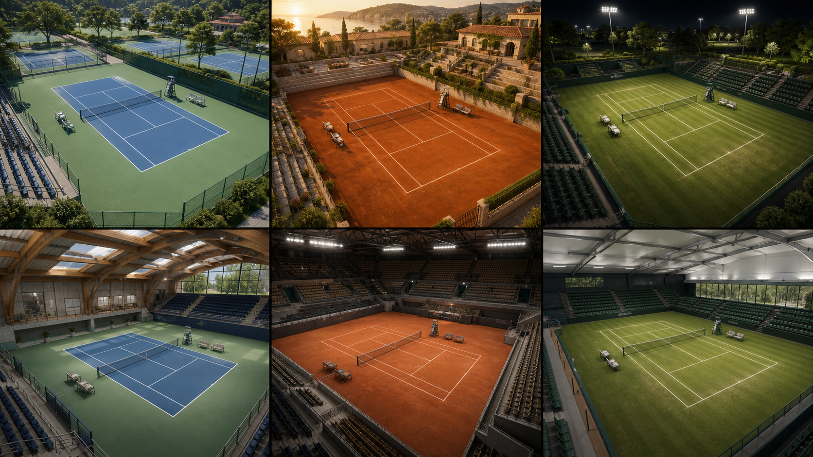
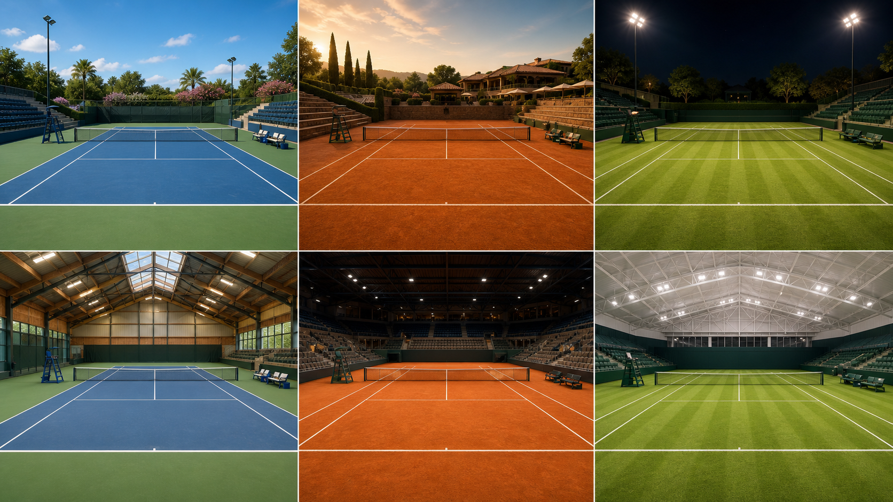

# Court environment concept boards: August 2026

- **Status:** Six directions accepted; Panel 1 accepted as the initial product baseline
- **Generated:** 2026-08-29 with the built-in OpenAI image-generation tool
- **Purpose:** art direction and venue/surface comparison, not geometry or implementation reference

## Bird's-eye environment board

## Player-level environment board

## Panel key

Both boards use the same left-to-right, top-row then bottom-row order:

1. Outdoor blue/green hard court, bright daytime, landscaped public-club complex.
2. Outdoor red clay court, warm late afternoon, Mediterranean club setting.
3. Outdoor grass court, night floodlights, elegant park-stadium setting.
4. Indoor hard court, modern timber/steel club hall with walls and skylights.
5. Indoor clay court, medium tournament stadium with tiered seating.
6. Covered grass court, contemporary arena with restrained seating and soft roof light.

Every candidate includes an umpire chair, player rest seating, and spectator seating without crowd models. The player-view board intentionally leaves a quiet visual corridor around the opponent striking zone and incoming ball path.

These six panels sample the requested design space. They do **not** reduce the V1 matrix, which comprises outdoor, indoor club-hall, and indoor-stadium shells combined with hard, clay, and grass surfaces.

## Accepted starting point

On 2026-08-29, the owner accepted all six candidate directions and selected **Panel 1, the bright outdoor blue/green hard-court complex**, as the visual and technical starting point for the product. On 2026-08-30, ADR-0005 made canonical Three.js composition the implementation path. Panel 1 is therefore the first scene for component modeling, procedural/PBR material development, lighting, camera calibration, neutral-character placement, and browser fidelity review. The other five environments remain required V1 variants, not rejected alternatives.

The reusable perspective prefixes and six independent environment descriptions are recorded in the [scene-generation prompt kit](scene-generation-prompt-kit.md).

## Initial observations

- Candidate 1 is the clearest default training environment: high ball contrast, modest visual complexity, and plausible public-app neutrality.
- Candidate 2 is the strongest warm premium/editorial mood, but sun glare and orange ball/background contrast need testing.
- Candidate 3 validates night/floodlight ambience, while the ball needs a controlled highlight/halo against lamps and dark foliage.
- Candidate 4 is the strongest quiet indoor-practice baseline and provides a useful material-language alternative to a generic arena.
- Candidate 5 carries tournament energy without crowds, but the darker background needs explicit opponent exposure and ball-readability tests.
- Candidate 6 is visually clean but should be treated as a covered/roofed grass-arena concept rather than evidence that a typical club hall uses grass.

Generated line markings, net details, chair placement, architecture, and scale contain visual inconsistencies. Implementation must use regulation code-owned geometry and verified safety/clearance dimensions.

## Remaining owner review prompts

1. Which indoor language should be implemented second: intimate club hall (4) or tournament stadium (5/6)?
2. Is the baseline seating density appropriately restrained, or should the player's view be even quieter?

## Generation prompts

### Bird's-eye prompt

> Create a polished game-realistic 3D environment concept sheet for a first-person tennis simulation web app. One single 16:9 presentation board containing six clearly separated equal panels in a clean 2x3 grid, each panel viewed from a high oblique bird's-eye camera so the full regulation tennis court and surrounding venue context are readable. No written labels, captions, logos, watermarks, people, or crowd figures. Show outdoor hard/daytime, outdoor clay/golden hour, outdoor grass/night, indoor hard/club hall, indoor clay/stadium, and covered grass/arena candidates. Every panel includes a regulation net and lines, umpire chair, player rest seating, spectator seating, access context, and appropriate fencing or walls. Keep geometry coherent and buildable, with realistic PBR materials and consistent modern sports-game rendering.

### Player-view prompt

> Create the matching six-panel 16:9 board from a wide player-eye-level viewpoint about 1.5 meters behind the center of the near baseline, camera height about 1.7 meters, looking across the net with an approximately 70-degree horizontal field of view. Show no near-player body, racket, opponent, people, logos, or text. Preserve a clear training view of the far court and opponent striking zone while retaining each venue's umpire chair, player rest seating, spectator seating, architecture, surface, and lighting character.
