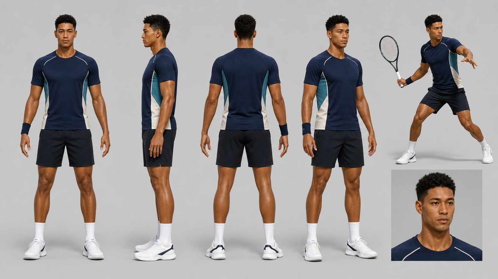

# Opponent character 01: right-handed male (historical concept)

> **Direction update (2026-08-30):** This sheet is no longer a production candidate. ADR-0005 replaces generated character appearance work with one neutral, faceless, rights-cleared humanoid GLB whose silhouette, rig quality, mocap behavior, and far-court readability take priority.

- **Status:** Proposed visual-design baseline; not a production mesh
- **Generated:** 2026-08-29 with the built-in OpenAI image-generation tool
- **Role:** first opponent used to test character generation, rigging, retargeting, animation blending, and far-baseline readability

## Design intent

This is an entirely fictional adult athlete with a mixed Black and East Asian visual identity. His tall, lean, long-reach silhouette and powerful lower body synthesize broad elite-tennis physique categories without reproducing a real player's face, identity, signature apparel, or exact body. The navy, teal, and off-white clothing is unbranded and uses large shapes that should remain readable from the opposite baseline.

The neutral turnaround is intentionally **racket-free**. A production racket should be a separate rigid GLB prop attached to `racket_socket.R` or `racket_socket.L`, not fused to or skinned with the character mesh. This provides:

- one clean body mesh for rigging and weight painting;
- interchangeable racket models and grip-offset tuning;
- reuse across right- and left-handed variants;
- no racket deformation from arm skin weights;
- independent racket LOD, material, collision/debug, and provenance.

The action inset establishes this design as right-handed, but it is only a pose and costume reference. The generated racket is not a production asset.

## Production interpretation

- Build or generate a clean A-pose/T-pose mesh from this sheet; do not attempt to reconstruct all views as exact photogrammetric evidence.
- Preserve the large-scale silhouette, body proportions, skin tone, hairstyle, and outfit color blocking; simplify micro-detail at the normal opponent distance.
- Keep shoes and fitted clothing deformation-friendly. Prefer modeled clothing that can share the body armature over cloth simulation.
- Deliver mesh, UVs, compact PBR textures, skeleton, skin weights, and named hand/racket sockets. The final target is an optimized GLB after Blender cleanup.
- Validate from the real player-level camera before spending on face detail. Footwork, contact pose, racket path, and silhouette have higher priority.

## Roster direction

The eventual roster should cross sex, handedness, skin tone/ethnicity, height, build, hairstyle, apparel silhouette, and movement style without making any one trait a caricature. Do not generate a combinatorial checklist of token variations. Each character should be an internally coherent fictional athlete, and both opponent hands must be supported by accepted motion and racket attachment.

This first sheet covers one right-handed male only. Female, left-handed, and additional ethnic/physique designs remain later asset-production tasks within V1 scope.

## Generation prompt

> Create a production-oriented character design sheet for an entirely fictional male professional tennis opponent intended for a game-realistic 3D web simulation. Adult male athlete in his late 20s, fictional mixed Black and East Asian heritage, with an original face that does not resemble any real athlete, celebrity, or public figure. Right-handed. Tall, lean, long-limbed and elastic, with long reach, powerful tennis-trained legs and glutes, a strong rotational core, athletic shoulders, low body fat, realistic proportions, and an explosive rather than bodybuilder-muscular build. Calm, focused competitive presence; short textured black hair; clean-shaven. Unbranded fitted deep-navy performance shirt with restrained teal and off-white panels, tailored dark shorts, white crew socks, hard-court shoes, and one simple right wristband. Landscape 16:9 on a clean warm-light-gray studio background. Show the exact same character and outfit in front, left-profile, back, and right-three-quarter full-body neutral A-pose views with empty hands and near-orthographic projection. Add one smaller action inset at the right showing a right-handed forehand preparation with a generic racket, and one neutral head-and-shoulders inset. Preserve exact identity and proportions in every view. Polished game-realistic PBR 3D character study with credible anatomy, fabric, softbox lighting, contact shadows, clean silhouettes, and no overlapping limbs. No recognizable real-person likeness, copied signature outfit, logos, sponsors, flags, tattoos, jewelry, text, watermark, UI, court, crowd, extra people, or racket in the turnaround views.

## Known image limitations

- A single generated sheet is a concept reference, not guaranteed multi-view geometric consistency.
- The action inset does not prove technically correct contact mechanics, grip, or racket scale.
- Hands, joint landmarks, garment seams, and facial symmetry need a modeler/rigging review.
- Production use requires a separate asset provenance and output-rights record for whichever 3D generator or artist creates the mesh.
