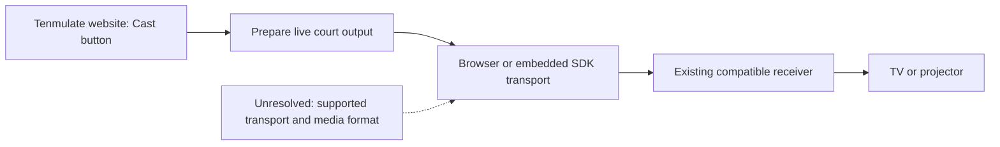

# Website-initiated casting to existing receivers

- **Date:** 2026-09-08
- **Status:** Research revised after owner clarification; no qualifying end-to-end implementation verified.
- **Question:** Can Tenmulate offer built-in casting from iOS, macOS, Windows and Android to `乐播投屏（SONY XR-75X95J）` and `奇异果TV`?
- **Scope:** A user opens the Tenmulate website, triggers casting there, and selects an existing TV/projector receiver. No receiver pairing, playback, installation or network configuration was performed.

## Owner requirements

- The sender is the Tenmulate website. The visitor needs no repository, developer environment or locally installed sender/helper.
- No Lebo desktop client, other desktop casting application, native mobile sender, browser extension or native wrapper is part of the solution.
- Use existing casting receivers, including the owner's Lebo/Sony and Qiyiguo services. Requiring the user to open a Tenmulate receiver webpage or install a custom receiver does not satisfy the requirement.
- The cast action belongs inside Tenmulate. Ordinary browser/device permission and receiver selection dialogs are compatible with that interaction; instructions to independently start system mirroring are only a fallback and do not fulfill the in-page trigger requirement.
- Preserve the original LAN transport objective. Website access alone does not establish that cloud media relaying is acceptable. A product-hosted backend would avoid a sender installation, but any media relay outside the LAN would change that transport property.
- The desired sender coverage is iOS, macOS, Windows and Android. Individual protocol/browser results must be reported separately.

## Answer

Under the clarified requirements, a universal cross-platform live-page Cast button to these existing receivers is **not yet established as feasible by the available evidence**. Capturing Tenmulate's court is possible; the unresolved part is a browser-accessible transport and receiver-control contract. There is no single ordinary-web API providing arbitrary AirPlay, DLNA, Google Cast and vendor-protocol mirroring.

The owner confirms both receivers appear in iOS Control Center and video-app casting menus. System **Screen Mirroring** could present the running app without a sender installation, but Safari's media AirPlay API is not a command to open system mirroring for an arbitrary WebGL page. That route remains a manual fallback, not the core product mechanism. [Apple mirroring instructions](https://support.apple.com/en-us/102661), [Safari media controls](https://developer.apple.com/documentation/webkitjs/adding_an_airplay_button_to_your_safari_media_controls).

An **embedded browser SDK for the installed receivers** remains a candidate, not an available integration dependency. Lebo announced Web SDK integration in 2023, but its current public SDK catalogue contains native packages and no Web sender package. This absence does not prove that a private/commercial Web SDK does not exist. It does mean the announcement cannot substantiate a ready-to-build cross-platform mirroring feature. [Web SDK announcement](https://www.lebo.cn/news/AboutNewsContent?id=1316), [current catalogue source](https://lebotob.hpplay.cn/web/sdkListObj.js).

Browser-native media casting can provide genuine in-page initiation on compatible systems, but Tenmulate would first have to supply media that the receiver can play. A live canvas is not automatically such a media source. Google Cast is a separate compatible-receiver route; neither named receiver has been verified as a Google Cast target.

## 1. What the receiver evidence proves

| Evidence | Supported conclusion | Still unverified |
| --- | --- | --- |
| Owner sees both names in iOS Control Center → Screen Mirroring | Both are advertised to the iOS mirroring picker on this setup | Successful mirroring, frame cadence, audio, installed software versions |
| Owner also sees both names in video-app casting menus | Those apps discover playback targets | Whether a particular app uses AirPlay, DLNA or a vendor protocol |
| Read-only HTTP GET at 23:15 China time returned the Sony/Lebo identity and DLNA services | The existing Lebo receiver is currently reachable at its previously discovered LAN endpoint | AirPlay handshake, WebRTC support, Google Cast support, available codecs |
| No independently identified Qiyiguo endpoint in this turn | Owner discovery is the available evidence for Qiyiguo | Its direct sender API and protocol-specific compatibility |

The live GET was `http://192.168.0.28:49152/description.xml`, returned HTTP 200, and identified `乐播投屏（SONY XR-75X95J）`, `MediaRenderer:1`, `AVTransport:1`, `ConnectionManager:1` and `RenderingControl:1`. The server banner includes `BDLE+DLNA/1.1 HPPlay/1.0`. See the [bounded readback receipt](lan-casting-receiver-readback-2026-09-08.json). This address is an observation, not a permanent application configuration.

AirPlay, DLNA, Google Cast and Miracast are different receiver paths. In particular, appearance in an iPhone picker does not establish Google Cast compatibility. Do not infer the China-market television's active Google Cast or Miracast services from another region's model specifications. A name can also identify one software service on a TV rather than a separate physical display.

Native desktop mirroring products and computer-to-custom-browser screen sharing are excluded from this product design, regardless of their independent usefulness.

## 2. Capture, transport and receiver are separate

**Whole-page capture:** `getDisplayMedia()` lets a supporting desktop browser capture a user-selected tab, window or display. It requires a secure context and an explicit user gesture/permission flow. It produces a `MediaStream`; it does not select an AirPlay/DLNA TV. The live MDN compatibility data lists Safari iOS and Chrome Android as unsupported, while desktop Chrome, Edge, Firefox and Safari have support. [API contract](https://developer.mozilla.org/en-US/docs/Web/API/MediaDevices/getDisplayMedia), [compatibility source checked on research date](https://github.com/mdn/browser-compat-data/blob/main/api/MediaDevices.json).

**Court-only capture:** `canvas.captureStream()` captures the WebGL canvas and is a much better cross-platform primitive for this app. Current compatibility data includes Safari/iOS and Chrome/Android. It captures the canvas's pixels, not surrounding React controls, and provides a video track rather than the Web Audio cues. Those need a separate audio track or receiver-side scheduling. Origin-clean assets, encoding load, WebGL capture correctness and mobile lifecycle still need testing. [Canvas API](https://developer.mozilla.org/en-US/docs/Web/API/HTMLCanvasElement/captureStream), [canvas compatibility source](https://github.com/mdn/browser-compat-data/blob/main/api/HTMLCanvasElement.json).

**Transport:** WebRTC needs a cooperating endpoint and signaling. The existing receiver's AirPlay/DLNA discovery does not establish either. A generic canvas-to-WebRTC implementation followed by a custom receiver page would violate the clarified scope. WebRTC becomes relevant only if an existing receiver/vendor exposes a compatible supported ingestion path. [WebRTC peer connections](https://webrtc.org/getting-started/peer-connections).

**Existing TV playback:** Safari's `webkitShowPlaybackTargetPicker()` and the Remote Playback API are media-element interfaces. They are not general React/WebGL page mirroring APIs. Putting a canvas `MediaStream` into a `<video>` does not establish that an AirPlay/DLNA target can consume it; that exact route needs proof, not an assumption. A blob URL is not a LAN media-server URL. [Apple media-element interface](https://developer.apple.com/documentation/webkitjs/htmlmediaelement), [W3C Remote Playback](https://www.w3.org/TR/remote-playback/).

Apple's media-format guidance explains that its AirPlay media route needs a transferable URL and demonstrates providing an HLS alternative for a JavaScript-managed video source. A possible no-install sender architecture is canvas capture → product-hosted live media service → playable HLS URL → Safari AirPlay picker → existing receiver. That is a backend-assisted media-streaming proposal, not proof of direct LAN mirroring. It introduces encoding, hosting, buffering and receiver-compatibility work; a cloud media service changes the original LAN-only property, and a user-installed local media server is excluded. [Apple WWDC media-format guidance](https://developer.apple.com/videos/play/wwdc2023/10122/).

The Presentation API does support a page-initiated selection dialog for **compatible** displays and presentation URLs. It does not implement every receiver protocol or prove that these two AirPlay/DLNA receivers can present the URL. [W3C Presentation API](https://www.w3.org/TR/presentation-api/).

Ordinary web pages also lack unrestricted native UDP/TCP access for implementing arbitrary receiver discovery and protocols. Chrome's Direct Sockets capability is scoped to Isolated Web Apps, which changes packaging and does not solve an ordinary cross-platform Safari website. [Chrome Direct Sockets](https://developer.chrome.com/docs/iwa/direct-sockets?hl=en).

## 3. Options for the requested devices

### iOS capture can be implemented in the frontend

The **capture layer itself** needs no native sender or backend: attach `canvas.captureStream()` to the existing Three.js canvas. Safari/iOS canvas capture and manual `requestFrame()` support are listed in current browser-compatibility data. This is app-canvas capture, not capture of arbitrary iPhone screen contents. API availability is separate from performance and correct frame delivery on a particular device. [Canvas capture](https://developer.mozilla.org/en-US/docs/Web/API/HTMLCanvasElement/captureStream), [canvas compatibility](https://github.com/mdn/browser-compat-data/blob/main/api/HTMLCanvasElement.json), [manual-frame compatibility](https://github.com/mdn/browser-compat-data/blob/main/api/CanvasCaptureMediaStreamTrack.json).

An efficient proposed implementation for Tenmulate would:

- Reuse the existing rendered canvas and scene. Avoid a second full Three.js render, per-frame `toDataURL`/`toBlob`, synchronous `readPixels`, JavaScript image encoding, and CPU screenshot/compositing loops. Browser-internal copies or GPU synchronization may still occur; the API promises neither zero-copy capture nor a particular overhead. [WebGL performance guidance](https://developer.mozilla.org/en-US/docs/Web/API/WebGL_API/WebGL_best_practices).
- Begin qualification at approximately 720p/30 fps while preserving the scene's aspect ratio, then test 720p/60 fps for tennis motion. These are proposed test profiles, not achieved results. Bound the actual drawing-buffer size; Retina device-pixel ratio can otherwise make it much larger than the CSS view. Reducing capture frame rate alone does not reduce the source render resolution. Keep simulation and motion clocks independent of capture cadence.
- Use one capture track while needed. A manual `captureStream(0)` / `requestFrame()` path can be evaluated with the render lifecycle; feature-detect it and verify actual frames. A simpler bounded `captureStream(30)` path is the baseline. Do not enable `preserveDrawingBuffer` globally merely to accommodate screenshot-based code. The currently inspected renderer (`main` at `a4f4015`) uses one WebGLRenderer and does not explicitly enable that option. [Capture scheduling contract](https://w3c.github.io/mediacapture-fromelement/).
- Route the existing cue/ambience mix into `AudioContext.createMediaStreamDestination()` and combine its audio track with the canvas video track. No microphone is needed for app-generated audio. Start/resume audio from the user's Cast action and verify audio/video timing through the eventual transport. HTML overlays are not included in canvas pixels; capture the court alone or explicitly design any required HUD composition. [Web Audio stream destination](https://developer.mozilla.org/en-US/docs/Web/API/AudioContext/createMediaStreamDestination).
- Keep encoding in the browser's native media pipeline once the receiver's required format is known. `MediaRecorder` can encode a MediaStream, but recorded chunks do not automatically constitute a live HLS endpoint or an AirPlay transport. Avoid choosing a JavaScript/WASM transcoder as the default mobile implementation. Hardware encoding availability and total cost must be measured for the selected device/codec; no hardware-acceleration guarantee is made. [WebKit MediaRecorder](https://webkit.org/blog/11353/mediarecorder-api/).
- Stop tracks and release capture/encoding resources when casting ends. Require an active foreground page; wake-lock support does not grant background execution or override iOS suspension.

Verify the **actual gameplay canvas** in three states: rendering alone, rendering plus capture, and rendering plus capture/encoding. Compare frame-time distributions, output cadence, stale/black frames, memory growth, audio skew and sustained slowdown on the target iPhone/iOS version. Historical WebKit canvas-capture defects justify checking actual output, but do not establish a defect in the current browser. [Historical WebKit capture issue](https://bugs.webkit.org/show_bug.cgi?id=230613).

Conclusion: efficient frontend capture is a credible and independently testable component. It does not remove the unresolved requirement for a supported browser-to-existing-receiver casting path. No iOS capture benchmark or runtime implementation was performed for this research.

| Route | Sender-only website requirement | Existing receiver fit | Qualification |
| --- | --- | --- | --- |
| In-page AirPlay media picker on iOS/macOS Safari | Yes for compatible media playback | AirPlay discovery reported; actual media playback untested | Does not automatically mirror the live canvas; playable-source pipeline unresolved |
| Google Cast Web Sender | Yes on supported browsers; iOS Chrome excluded | Google Cast service not established for either target | Limited compatible-target route; not coverage for both named receivers |
| Embedded Lebo Web SDK | Would qualify if it actually runs in an ordinary browser without a native bridge | Relevant to Lebo; Qiyiguo requires separate proof | Public announcement exists; current usable Web package and live LAN transport contract not established |
| Native iOS/macOS mirroring or Chrome browser-menu casting | No sender installation | Protocol-dependent | Manual fallback; does not meet the in-page initiation requirement |
| Generic WebRTC receiver page or TV-side Tenmulate renderer | Sender could be a website | Requires a different receiver experience | Excluded by owner |
| Native apps, wrappers, extensions or local sender/media bridge | Requires more than website access | Depends on implementation | Excluded by owner |

Apple documents Mac screen/window sharing through AirPlay. Google distinguishes browser casting from an integrated sender/receiver app, and explicitly excludes iOS Chrome from Web Sender support. A Cast button therefore cannot serve as the sole cross-platform solution. [Mac AirPlay](https://support.apple.com/en-gb/guide/mac-help/mchld7e543a0/mac), [Google Web Sender requirements](https://developers.google.com/cast/docs/web_sender), [Cast architecture](https://developers.google.com/cast/docs/overview).

Native iOS/Android SDK coverage must not be presented as Safari/Chrome website coverage. Similarly, a TV-side Tenmulate application or manually opened receiver webpage is not an eligible substitute for the existing receiver.

“An emulated page” has two possible meanings. Running the Tenmulate simulation in Safari on a real iPhone can use that phone's system AirPlay. Selecting an iPhone viewport/user agent in a Windows browser does not add iOS's native AirPlay services.

### Lebo: investigate an embedded Web contract, not its desktop client

The official [web service announcement](https://www.lebo.cn/news/AboutNewsContent?id=1130) is evidence of a vendor browser product. Redirecting users away from Tenmulate to operate that product does not establish an embedded Tenmulate mechanism. It also advertises URL-based cloud presentation: a remote loader would not inherit Tenmulate's browser storage or active drill. A product demonstration is insufficient to infer an embeddable live mirroring API.

At 23:26 China time, the [current developer site's](https://cloud.lebo.cn/) directly referenced [SDK catalogue](https://lebotob.hpplay.cn/web/sdkListObj.js) listed Android and iOS push/mirroring SDKs, a HarmonyOS entry under mirroring, and an Android receiver SDK. It contained no Web sender entry. The listed native package dates range through 2026-08-11. See the [catalogue receipt](lan-casting-sdk-catalogue-2026-09-08.json). This is narrower, more current evidence than the [June 2023 Web integration announcement](https://www.lebo.cn/news/AboutNewsContent?id=1316); it does not exclude a separately distributed partner product.

Before treating this as an implementation dependency, establish:

- Whether the currently offered Web SDK accepts a live canvas/tab stream, or only URLs/files and presentation-space content.
- Whether it can execute within Tenmulate's origin without a native companion, extension, receiver replacement or redirection to a separate sender product.
- Which browser/OS and installed receiver versions support that specific mode, including Qiyiguo if claimed.
- Whether media stays on the LAN, and whether authentication, discovery or ongoing operation requires internet access.
- Available frame rate, resolution, audio, reconnection behavior, licensing, branding, account and fee requirements.

The research fetch found the official web service, but live UI inspection timed out in the available browser tool. No sign-in, casting code, capture permission or playback was attempted. Consequently the service is a vendor-documented candidate, not an operationally verified result. No current SDK artifact or entitlement was established, and no vendor was contacted.

### DLNA does not by itself provide the missing website transport

DLNA discovery is useful evidence, but sending a live page through it means creating a compatible media stream and serving it to the TV, plus discovering and controlling the receiver. A locally installed FFmpeg/HTTP/UPnP bridge is outside scope. The presence of an HTTP device-description endpoint does not establish cross-origin control access or supply a browser-native DLNA casting API. Browser local-network permissions alone do not create the missing protocol implementation.

## 4. Fit with the current Tenmulate code

Code was inspected with local `main` at `4526370`. Concurrent rehearsal/fullscreen working-tree edits were present during research and are excluded from this documentation change. The observations below concern the inspected rendering, clock and audio paths; they do not certify the concurrent UI work:

- [Vite configuration](../../vite.config.ts) binds dev and preview to `127.0.0.1`. A phone cannot reach that address on the PC. LAN hosting must deliberately use a reachable interface; capture and related web capabilities require an appropriate trusted origin. HTTP on a private LAN IP is not automatically a secure origin.
- [SceneViewport](../../src/components/SceneViewport.tsx) calls `setActive(active && !document.hidden)`. [TennisScene](../../src/engine/rendering/TennisScene.ts) disables its animation loop when inactive. A hidden/minimized sender may therefore stop producing fresh frames even if a transport remains connected.
- [RehearsalScreen](../../src/components/RehearsalScreen.tsx) pauses a playing session on document hiding. Fullscreen must be capability-checked on the actual mobile browser; the existing button alone does not establish iOS fullscreen acceptance.
- [useSessionPlayer](../../src/hooks/useSessionPlayer.ts) maintains a local `requestAnimationFrame` clock with capped frame deltas. It is not a distributed clock. Starting identical drills on two devices would not provide durable synchronization by itself.
- [AudioCueEngine](../../src/engine/audio/AudioCueEngine.ts) sends oscillator cues to the local audio destination. Canvas capture alone would omit them.
- [SharedCourt](../../src/components/SharedCourt.tsx) owns the shared court presentation. [compileSession](../../src/engine/session/compileSession.ts) and the [architecture](../technical-architecture.md) provide useful boundaries for a receiver mode. Existing local storage is not shared between devices.
- No current `RTCPeerConnection`, casting SDK, `captureStream`, `getDisplayMedia`, WebSocket transport or wake-lock implementation was found in `src`.

The intended **Cast** entry must initiate an actual supported adapter, expose receiver selection/connection state, and stop the session. It must not report success from merely showing native-mirroring instructions. Feature detection must distinguish capture availability from transport and receiver compatibility.

Once a qualifying transport exists, the frontend can prepare canvas output, add the cue audio bus, manage connection state, and preserve the active sender lifecycle. Do not globally remove hidden-page suspension on the assumption that it solves mobile background execution. Capture/encoding must not change ball pace, source motion clocks, contact alignment or the recovery planner.

No custom receiver renderer or distributed playback architecture is recommended under this scope. A web-initiated media route may still require a product backend; such a proposal must state explicitly whether media leaves the LAN rather than equating no installation with local transport.

## 5. Recommendation and next evidence

1. **Resolve the browser-to-existing-receiver contract first.** For Lebo, require a current browser SDK/sample and explicit supported platforms, receiver versions, media inputs and LAN behavior. No qualifying public Web package has been found. Do not substitute native packages or infer Qiyiguo compatibility.
2. **Separate media casting from live page mirroring in any proof.** A Safari AirPlay picker playing an accessible test video proves browser-initiated media casting only. A real Tenmulate stream needs a separate live-source proof. Backend-assisted HLS is a conditional architecture, not a solution already meeting the LAN requirement.
3. **Require an end-to-end proof before adding the product feature.** From a normal browser on each claimed sender platform, press Cast inside Tenmulate, select the existing receiver, show current court frames and synchronized audio, change/pause the drill and stop casting. No sender install, extension, custom receiver page or receiver replacement may be used to pass this proof.

The researched outcome is therefore conditional: native media APIs and a possible vendor Web transport offer limited paths, but there is currently no verified mechanism satisfying all of the owner's requirements. Manual system mirroring can remain an explicitly labeled fallback if desired; it is not acceptance of the requested in-page mechanism.

Measure frame cadence, dropped/stale frames, glass-to-glass delay, command response and audio/video skew separately. Record the actual sender/receiver versions, connection path and resolution. Start with a short representative practice run, orientation/fullscreen changes and one disconnect/reconnect; broaden to a longer thermal/stability run only for a promising route.

For shadow swinging driven entirely by the TV, a stable common delay can preserve the visual relationship between opponent contact and incoming ball. Variable buffering, stutters, or hearing local cues before the TV image are more disruptive. Do not alter ball speed or motion rhythm to conceal network latency. Calibrate the camera against the visible TV picture and viewing distance; phone aspect-ratio letterboxing can change the effective image area. These are application-specific engineering judgments, not measured performance claims.

“Local media” and “fully offline” are separate acceptance criteria. Confirm the selected media path; if offline operation matters, also verify startup, pairing, asset delivery and reconnection without WAN access in a planned test. No transport, latency, TV rendering, owner acceptance or deployment result is claimed by this research.
