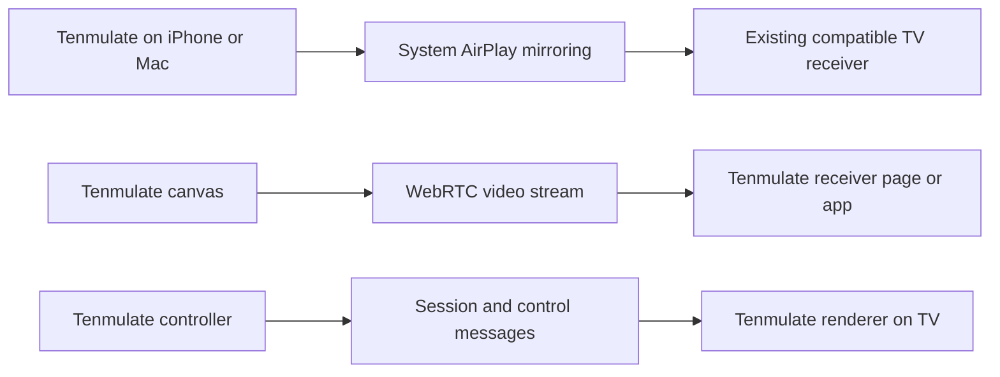

# LAN casting and browser mirroring feasibility

- **Date:** 2026-09-08
- **Status:** Research and proposed validation sequence; no casting implementation or accepted architecture decision.
- **Question:** Can Tenmulate offer built-in casting from iOS, macOS, Windows and Android to `乐播投屏（SONY XR-75X95J）` and `奇异果TV`?
- **Scope:** Live court/page presentation, existing receiver compatibility, browser APIs, LAN transport and current application fit. No receiver pairing, playback, installation or network configuration was performed.

## Answer

Yes, Tenmulate can support a useful casting experience. There is no single ordinary-web API that mirrors its entire page to every AirPlay, DLNA, Google Cast and proprietary receiver across those platforms. A product can present one entry point while using different transports underneath it.

The immediate route is to run Tenmulate on an actual iPhone/iPad and use system **Screen Mirroring**. The owner confirms that both named receivers appear in Control Center and in video-app casting menus. This is strong evidence for an AirPlay mirroring path on this installation, but it is not a completed connection or gameplay test. Apple documents mirroring the device screen, including its running applications, to compatible receivers. A browser page cannot use the Safari video AirPlay button as a general command to start system screen mirroring. [Apple mirroring instructions](https://support.apple.com/en-us/102661), [Safari media controls](https://developer.apple.com/documentation/webkitjs/adding_an_airplay_button_to_your_safari_media_controls).

There is also a relevant vendor route: **Lebo advertises both a web casting service and Web SDK integration**. It should be evaluated before writing a custom AirPlay sender. Public announcements establish that these products were offered; they do not establish a current downloadable SDK contract, local-only operation, arbitrary WebGL capture or compatibility with this installed TV build. [Lebo web service announcement, 2023-01-17](https://www.lebo.cn/news/AboutNewsContent?id=1130), [Web SDK integration announcement, 2023-06-28](https://www.lebo.cn/news/AboutNewsContent?id=1316).

For a transport we control, a **Tenmulate receiver page/app** can receive a canvas stream over WebRTC, or render the drill itself from synchronized session data. These are feasible architectures requiring development and actual TV validation; the two existing receiver names do not imply that they can run either one.

## 1. What the receiver evidence proves

| Evidence | Supported conclusion | Still unverified |
| --- | --- | --- |
| Owner sees both names in iOS Control Center → Screen Mirroring | Both are advertised to the iOS mirroring picker on this setup | Successful mirroring, frame cadence, audio, installed software versions |
| Owner also sees both names in video-app casting menus | Those apps discover playback targets | Whether a particular app uses AirPlay, DLNA or a vendor protocol |
| Read-only HTTP GET at 23:15 China time returned the Sony/Lebo identity and DLNA services | The existing Lebo receiver is currently reachable at its previously discovered LAN endpoint | AirPlay handshake, WebRTC support, Google Cast support, available codecs |
| No independently identified Qiyiguo endpoint in this turn | Owner discovery is the available evidence for Qiyiguo | Its direct sender API and protocol-specific compatibility |

The live GET was `http://192.168.0.28:49152/description.xml`, returned HTTP 200, and identified `乐播投屏（SONY XR-75X95J）`, `MediaRenderer:1`, `AVTransport:1`, `ConnectionManager:1` and `RenderingControl:1`. The server banner includes `BDLE+DLNA/1.1 HPPlay/1.0`. See the [bounded readback receipt](lan-casting-receiver-readback-2026-09-08.json). This address is an observation, not a permanent application configuration.

AirPlay, DLNA, Google Cast and Miracast are different receiver paths. In particular, appearance in an iPhone picker does not establish Google Cast compatibility. Do not infer the China-market television's active Google Cast or Miracast services from another region's model specifications. A name can also identify one software service on a TV rather than a separate physical display.

The premise that Windows cannot mirror its desktop is too broad. Google documents whole-screen and tab casting from Windows to Google Cast receivers. Lebo lists Windows and Mac senders, and Deskreen is a computer-to-browser screen-sharing project. Their receiver requirements differ. [Chrome casting](https://support.google.com/chromecast/answer/3228332?hl=en), [Lebo downloads/platforms](https://www.lebo.cn/), [Deskreen project](https://github.com/pavlobu/deskreen).

## 2. Capture, transport and receiver are separate

**Whole-page capture:** `getDisplayMedia()` lets a supporting desktop browser capture a user-selected tab, window or display. It requires a secure context and an explicit user gesture/permission flow. It produces a `MediaStream`; it does not select an AirPlay/DLNA TV. The live MDN compatibility data lists Safari iOS and Chrome Android as unsupported, while desktop Chrome, Edge, Firefox and Safari have support. [API contract](https://developer.mozilla.org/en-US/docs/Web/API/MediaDevices/getDisplayMedia), [compatibility source checked on research date](https://github.com/mdn/browser-compat-data/blob/main/api/MediaDevices.json).

**Court-only capture:** `canvas.captureStream()` captures the WebGL canvas and is a much better cross-platform primitive for this app. Current compatibility data includes Safari/iOS and Chrome/Android. It captures the canvas's pixels, not surrounding React controls, and provides a video track rather than the Web Audio cues. Those need a separate audio track or receiver-side scheduling. Origin-clean assets, encoding load, WebGL capture correctness and mobile lifecycle still need testing. [Canvas API](https://developer.mozilla.org/en-US/docs/Web/API/HTMLCanvasElement/captureStream), [canvas compatibility source](https://github.com/mdn/browser-compat-data/blob/main/api/HTMLCanvasElement.json).

**Transport:** WebRTC can carry that stream to another cooperating browser/app. It needs signaling to exchange session descriptions and ICE candidates. A short pairing code/QR can identify the session; it does not replace signaling. LAN media can be direct, but a cloud signaling service or TURN relay would introduce external dependencies. Strictly local operation requires local app delivery/signaling, reachable peers and verification of the selected network path. [WebRTC peer connections](https://webrtc.org/getting-started/peer-connections).

**Existing TV playback:** Safari's `webkitShowPlaybackTargetPicker()` and the Remote Playback API are media-element interfaces. They are not general React/WebGL page mirroring APIs. Putting a canvas `MediaStream` into a `<video>` does not establish that an AirPlay/DLNA target can consume it; that exact route needs proof, not an assumption. A blob URL is not a LAN media-server URL. [Apple media-element interface](https://developer.apple.com/documentation/webkitjs/htmlmediaelement), [W3C Remote Playback](https://www.w3.org/TR/remote-playback/).

Ordinary web pages also lack unrestricted native UDP/TCP access for implementing arbitrary receiver discovery and protocols. Chrome's Direct Sockets capability is scoped to Isolated Web Apps, which changes packaging and does not solve an ordinary cross-platform Safari website. [Chrome Direct Sockets](https://developer.chrome.com/docs/iwa/direct-sockets?hl=en).

## 3. Options for the requested devices

| Route | Senders | Existing receiver fit | What Tenmulate could build |
| --- | --- | --- | --- |
| System AirPlay mirroring | iOS/iPadOS and macOS | Promising given owner discovery; test each receiver and OS | Clean landscape presentation, hideable controls, supported wake-lock/fullscreen behavior, concise system instructions |
| Chrome's built-in tab casting | Desktop Windows/macOS/Linux/ChromeOS | Requires a Google Cast target; unconfirmed here | A presentation view and browser instructions |
| Google Cast SDK | Supported web senders plus separate native Android/iOS SDKs | Requires Google Cast receiver compatibility | A Cast sender and custom receiver for live application behavior |
| Lebo web service / vendor SDK | Web offering plus native platform products; exact SDK matrix unresolved | Most relevant vendor candidate for installed Lebo; Qiyiguo requires separate proof | First evaluate service; integrate only an available supported SDK contract |
| Canvas stream over WebRTC | Candidate across the requested browser platforms | Requires our receiver page/app; does not directly attach to existing AirPlay/DLNA names | Pairing, signaling, stream sender, decoder UI and transport state |
| TV renders Tenmulate; phone/computer controls it | Controller can be any supported browser | Requires compatible TV browser/app with adequate WebGL 2 performance | Receiver mode and synchronized session/control protocol |
| Encode live video and send a DLNA media URL | Usually needs a local bridge/media server | Lebo's DLNA service is verified; codec/live support is not | Encoder, URL server and protocol adapter; poorly suited as the first live-practice route |

Apple documents Mac screen/window sharing through AirPlay. Google distinguishes browser casting from an integrated sender/receiver app, and explicitly excludes iOS Chrome from Web Sender support. A Cast button therefore cannot serve as the sole cross-platform solution. [Mac AirPlay](https://support.apple.com/en-gb/guide/mac-help/mchld7e543a0/mac), [Google Web Sender requirements](https://developers.google.com/cast/docs/web_sender), [Cast architecture](https://developers.google.com/cast/docs/overview).

If a native wrapper is later chosen, iOS ReplayKit and Android MediaProjection are capture building blocks, not universal TV transports. They would still need a compatible vendor or custom receiver path. [ReplayKit](https://developer.apple.com/documentation/replaykit), [Android media projection](https://developer.android.com/media/grow/media-projection).

“An emulated page” has two possible meanings. Running the Tenmulate simulation in Safari on a real iPhone can use that phone's system AirPlay. Selecting an iPhone viewport/user agent in a Windows browser does not add iOS's native AirPlay services.

### Lebo deserves a bounded trial

The official announcement directs computer browsers to [lebo.top](https://www.lebo.top/) and describes using the TV's numeric casting code without installing a PC client. It also advertises sending a webpage URL into a cloud-powered presentation space. Sending a URL is different from mirroring an already-running local browser session: the remote loader may not reach a private LAN URL, and it will not inherit Tenmulate's browser storage or current drill.

The January 2023 announcement named TV version 8.13.20 or later for its new features. This is historical vendor guidance, not a verified current minimum for the installed TV. The June 2023 announcement explicitly describes Web SDK integration. The current developer landing page advertises sender/receiver SDKs, DLNA and lelink. [Web service announcement](https://www.lebo.cn/news/AboutNewsContent?id=1130), [Web integration announcement](https://www.lebo.cn/news/AboutNewsContent?id=1316), [developer platform](https://cloud.lebo.cn/).

Before treating this as an implementation dependency, establish:

- Whether the currently offered Web SDK accepts a live canvas/tab stream, or only URLs/files and presentation-space content.
- Which browser/OS and installed receiver versions support that specific mode, including Qiyiguo if claimed.
- Whether media stays on the LAN, and whether authentication, discovery or ongoing operation requires internet access.
- Available frame rate, resolution, audio, reconnection behavior, licensing, branding, account and fee requirements.

The research fetch found the official web service, but live UI inspection timed out in the available browser tool. No sign-in, casting code, capture permission or playback was attempted. Consequently the service is a vendor-documented candidate, not an operationally verified result. No current SDK artifact or entitlement was established, and no vendor was contacted.

### DLNA is a fallback for video, not the preferred live court path

DLNA discovery is useful evidence, but sending a live page through it means creating a compatible media stream and serving it to the TV. The open-source `dlna-cast` project implements FFmpeg capture, HLS and an HTTP server, and reports latency of five seconds or more for its path. This is an implementation-specific warning, not a universal lower bound for DLNA or all HLS. It is a better candidate for exported drill videos than responsive live adjustments. [dlna-cast implementation](https://github.com/link89/dlna-cast).

## 4. Fit with the current Tenmulate code

Code was inspected with local `main` at `4526370`. Concurrent rehearsal/fullscreen working-tree edits were present during research and are excluded from this documentation change. The observations below concern the inspected rendering, clock and audio paths; they do not certify the concurrent UI work:

- [Vite configuration](../../vite.config.ts) binds dev and preview to `127.0.0.1`. A phone cannot reach that address on the PC. LAN hosting must deliberately use a reachable interface; capture and related web capabilities require an appropriate trusted origin. HTTP on a private LAN IP is not automatically a secure origin.
- [SceneViewport](../../src/components/SceneViewport.tsx) calls `setActive(active && !document.hidden)`. [TennisScene](../../src/engine/rendering/TennisScene.ts) disables its animation loop when inactive. A hidden/minimized sender may therefore stop producing fresh frames even if a transport remains connected.
- [RehearsalScreen](../../src/components/RehearsalScreen.tsx) pauses a playing session on document hiding. Fullscreen must be capability-checked on the actual mobile browser; the existing button alone does not establish iOS fullscreen acceptance.
- [useSessionPlayer](../../src/hooks/useSessionPlayer.ts) maintains a local `requestAnimationFrame` clock with capped frame deltas. It is not a distributed clock. Starting identical drills on two devices would not provide durable synchronization by itself.
- [AudioCueEngine](../../src/engine/audio/AudioCueEngine.ts) sends oscillator cues to the local audio destination. Canvas capture alone would omit them.
- [SharedCourt](../../src/components/SharedCourt.tsx) owns the shared court presentation. [compileSession](../../src/engine/session/compileSession.ts) and the [architecture](../technical-architecture.md) provide useful boundaries for a receiver mode. Existing local storage is not shared between devices.
- No current `RTCPeerConnection`, casting SDK, `captureStream`, `getDisplayMedia`, WebSocket transport or wake-lock implementation was found in `src`.

For the first UX stage, a proposed **Show on TV** entry could prepare a clean court view and display platform-specific steps. It must not report a native AirPlay session as connected based merely on an instruction being shown; browser-visible native mirroring status is not a reliable general contract.

For a WebRTC stage, capture the existing canvas, deliberately include or exclude the HUD, add an audio bus, and expose real pairing/connection/stop states. Do not globally remove hidden-page suspension on the assumption that it solves mobile background execution. Test the active sender lifecycle and handle interruption explicitly.

For a TV-rendered stage, preload matching assets and versioned session data; use the TV's session clock as playback authority while the phone/computer sends commands. If simultaneous source playback is required, add explicit clock synchronization and reconciliation. Include pause, seek, rate changes, restart, disconnect and resume semantics. Preserve the shared recovery planner, contact alignment, source motion clocks and independent ball pace. This avoids transmitting every rendered frame, but shifts the rendering workload to the receiver and still needs performance proof.

## 5. Recommendation and next evidence

1. **Validate native iOS mirroring first on both named targets.** Open the real app on a real phone/iPad through a reachable origin; mirror with Control Center; compare actual court motion and audio. This is the shortest route to the requested minimum.
2. **Evaluate Lebo's official desktop web service with the same scene.** Establish whether its offered mode mirrors the live tab, sends a URL to another renderer, or supports both. Separately establish LAN routing and the SDK contract before choosing an integration.
3. **For controlled cross-platform LAN operation, prototype a Tenmulate receiver.** Start with WebRTC canvas streaming if TV decoding is the better hardware fit; compare TV-side rendering if its WebGL 2 performance is adequate. These can coexist with native AirPlay guidance.

Measure frame cadence, dropped/stale frames, glass-to-glass delay, command response and audio/video skew separately. Record the actual sender/receiver versions, connection path and resolution. Start with a short representative practice run, orientation/fullscreen changes and one disconnect/reconnect; broaden to a longer thermal/stability run only for a promising route.

For shadow swinging driven entirely by the TV, a stable common delay can preserve the visual relationship between opponent contact and incoming ball. Variable buffering, stutters, or hearing local cues before the TV image are more disruptive. Do not alter ball speed or motion rhythm to conceal network latency. Calibrate the camera against the visible TV picture and viewing distance; phone aspect-ratio letterboxing can change the effective image area. These are application-specific engineering judgments, not measured performance claims.

“Local media” and “fully offline” are separate acceptance criteria. Confirm the selected media path; if offline operation matters, also verify startup, pairing, asset delivery and reconnection without WAN access in a planned test. No transport, latency, TV rendering, owner acceptance or deployment result is claimed by this research.
