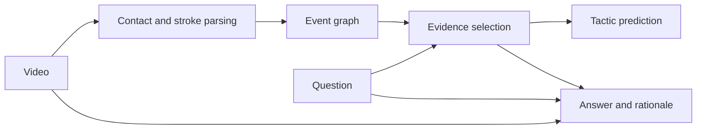

# TennisVAR and TANS: a guided reading course

Research date: 2026-09-08. Status: research and interpretation, not an accepted product change.

Read this course first. The separate [Tenmulate integration assessment](tennisvar-tans-integration-2026-09-08.md) applies the research to the existing system.

## 1. Your reading packet

| Paper | Verified identity | Read it |
| --- | --- | --- |
| TennisVAR: A Stroke-Evidence-Grounded Multimodal Large Language Model for Tactical Reasoning in Tennis Videos | Yifan Mei and colleagues; arXiv 2608.12920v1, submitted August 13, 2026; 9 pages including references. The abstract metadata spells one author's name Qingling Shi; the typeset paper uses Qinglin Shi. | [Original versioned PDF](https://arxiv.org/pdf/2608.12920v1), [HTML](https://arxiv.org/html/2608.12920v1), [local download](../../output/pdf/TennisVAR-2608.12920v1.pdf) |
| TANS: A Chess-Inspired Notation System for Strategy Analysis of Tennis Games | Yuexi Song, Chuanfei Li, Hao Cao, Ling Wu, Huanhuan Zheng, and Zhenkai Liang; ISACE 2025; supplied manuscript has 15 pages, including appendices. | [Authors' PDF](https://tennis-ans.github.io/publications/ISACE25-TANS.pdf), [project and tools](https://tennis-ans.github.io/); your original is `F:\Codes\Tenlysis\doc\ISACE25-TANS.pdf` |

The TennisVAR image identifies the first paper correctly. Its verified publication status is an arXiv preprint; an accepted conference venue was not established. TANS's project page identifies its ISACE 2025 publication and Distinguished Paper Award. These are different publication histories.

The original TennisVAR PDF was downloaded without modification. The local TANS file is byte-for-byte identical to the authors' current PDF. Full source receipts and the exact upstream code revision are in the integration assessment. Statements below distinguish the authors' reports, general explanations, and this review's deductions. Examples marked **illustrative** are teaching examples, not benchmark instances or official taxonomy entries.

## 2. The problem before the mathematics

Imagine a rally with five shots. A serves wide; B returns; A attacks the opposite side; B stretches for a defensive reply; A finishes at the net.

There are several different things an analytical system might do:

1. Locate the ball in each video frame.
2. Identify the shots and who hit them.
3. Record where everyone was and where each ball went.
4. Explain how the earlier shots created an opportunity.
5. Predict what would happen if a player chose another shot.
6. Turn a selected situation into a useful practice exercise.

Success at one does not establish success at the next. A tracking system can be accurate without understanding tactics. A fluent commentator can sound convincing while pointing to the wrong shot. An explanation of a completed rally does not establish the best decision before the outcome was known.

TennisVAR principally addresses evidence-backed explanations. TANS principally addresses compact, reusable records. Tenmulate supplies a possible rehearsal destination. Keeping these jobs distinct makes the papers much easier to read.

## 3. TennisVAR in one pass

The paper connects video perception to tactical interpretation through explicit strokes. Its proposed output includes an answer, a three-level tactic label, supporting strokes, decisive actions, and a rationale. Each evidence stroke refers back to a racket-ball contact frame. TRACE supplies expert-reviewed supervision. The model parses events, relates them across the rally, selects question-relevant evidence, and generates an explanation. The central contribution is the joint task and event-based architecture, rather than a newly invented general-purpose language model. [Paper, pp. 1-5](https://arxiv.org/html/2608.12920v1).

An **illustrative** question is: “How did A create the finishing opportunity?” A useful response would identify the wide serve and subsequent direction change as setup, identify the approach as a key action, and let the reader inspect those contacts. “A played aggressively” supplies much less information because it cannot readily be checked.

### Background vocabulary

| Term | Meaning for a reader |
| --- | --- |
| Multimodal language model | A model that processes language and visual inputs. It can describe or answer questions about pictures/video. |
| Event | A discrete occurrence in continuous footage, such as one racket-ball contact. |
| Grounding | Connecting a claim to identifiable observations. A timestamp is an address for inspection, not proof by itself. |
| Supervised learning | Training against examples containing desired outputs. |
| Embedding/token | A numerical representation used by a neural network. An event token can combine visual and symbolic information. |
| Graph | Events represented as nodes, with specified relationships represented as edges. |
| Attention | Learned weighting of information when forming a representation. Large attention weights alone do not prove a causal explanation. |
| Ablation | Removing a component while trying to keep the remaining experiment comparable. It tests what changes when that component is absent. |
| LoRA | Training small low-rank parameter additions while leaving a pretrained model's original parameters frozen. |
| Oracle input | Perfect information supplied by annotations that the deployed system would have to estimate for itself. |

### Two different kinds of “three levels”

Do not confuse a **taxonomy's depth** with a **question's reasoning demand**.

A hierarchical taxonomy assigns increasingly specific categories. An illustrative hierarchy would be “attack → net transition → approach-and-finish”; it is not offered here as an exact TRACE label path. The complete versioned TRACE class dictionary was not available in the checked release.

Question difficulty instead asks how much interpretation is needed. Factual perception concerns what happened; tactical understanding concerns relationships among actions; decision reasoning concerns a decision and its observable consequences. A taxonomy label and a question level answer different questions about an example.

## 4. Reading the methodology as a pipeline



This diagram is a simplified teaching aid. It retains the global-video route because the proposed generator has more context than selected event labels alone.

### Step A: Turn frames into events

The named perception ingredients are DINOv3 appearance features, short-term motion features, TrackNet ball-trajectory features, and an F3ED temporal encoder. EPM is the paper's name for the resulting event-parsing module. [Paper, p. 4, Eq. 3-5](https://arxiv.org/html/2608.12920v1).

Think of the inputs as complementary clues. Appearance helps distinguish players and court context. Motion helps locate sudden changes. Ball position over time helps constrain where a contact could have occurred. A temporal encoder uses neighboring moments rather than treating every frame as an unrelated photograph.

The important modeling move is compression into meaningful units. Downstream reasoning can work over “shot 3 by A at this contact time” instead of an undifferentiated stack of pixels. Compression is useful, but mistaken event boundaries can propagate: missing a stroke may remove the very setup needed to explain the rally.

A contact frame is also different from a bounce frame. In future data exchange they must have different fields. Confusing them shifts both the meaning of a destination and the moment a player had to act.

### Step B: Represent relationships

The proposed graph includes chronological neighbors and successive actions by the same player. TGTR, the Tactical Graph-Guided Temporal Reasoner, processes this structure. [Paper, pp. 4-5, Eq. 6](https://arxiv.org/html/2608.12920v1).

For the illustrative sequence A1, B2, A3, B4, A5:

```text
Rally order:       A1 → B2 → A3 → B4 → A5
A's own sequence: A1 ─────→ A3 ─────→ A5
B's own sequence:      B2 ─────→ B4
```

The first path preserves the exchange. The other paths make repeated choices by one player easy to represent. They can help distinguish a sustained pattern from an isolated final shot.

Neither edge type establishes intention or causality. “These were A's consecutive actions” is directly definable. “A planned this entire sequence” requires stronger evidence. An interpretable graph should not encourage us to conflate the two.

### Step C: Select evidence for the question

The proposed system scores supporting events and key actions separately. Evidence contributes to the representation used for tactic classification, through the Evidence Router. [Paper, p. 5, Eq. 7-8](https://arxiv.org/html/2608.12920v1).

Why condition selection on a question? In the same five-shot rally, “Who won?” may need the ending. “What created the opening?” needs earlier exchanges. A single fixed highlight clip cannot serve every question equally well.

Why distinguish evidence and key action? Several events can be necessary to understand a pattern while one is especially decisive. A useful interface would show the whole support sequence and emphasize the decisive part. It would also permit “insufficient evidence,” because some questions cannot be answered from the available observations.

The router uses a weighted event representation alongside a global graph representation and the question. That makes evidence part of the computation, but it is not a strict guarantee that every output depends only on the displayed evidence. Testing that stronger claim would require interventions, such as removing or changing cited events and measuring the response.

### Step D: Learn despite imperfect detection

The intended training formulation aligns predicted contacts with annotated evidence using one-to-one matching within a tolerance, maximizing matches before minimizing time offsets. [Paper, p. 5, Eq. 9-10](https://arxiv.org/html/2608.12920v1).

The general issue is easy to understand. Suppose the annotated sequence has five strokes but the detector produces four. “Evidence is stroke number 4” no longer necessarily addresses the same action. Aligning actual contact times helps avoid teaching the reasoner with identities it will not possess at inference.

This is a valuable deployment concern: a model trained only behind perfect perception can fail when connected to a real detector. However, the inspected public implementation uses greedy distance-sorted matching, which does not always satisfy the paper's maximum-cardinality objective. The integration assessment includes a small counterexample. The intended method and currently released implementation should therefore be read separately.

### Step E: Generate the explanation

The paper uses Qwen3-VL-8B with LoRA, supplied with a question, global frames, selected local visual windows, and an event table. Its stated design assigns structured tactic/evidence/key-action fields to TGTR and answer/rationale generation to Qwen. [Paper, p. 5, Eq. 11](https://arxiv.org/html/2608.12920v1).

This design resembles a technical report whose analysis has structured inputs and whose prose is written afterward. The prose still needs checking. Language generation can introduce claims that are absent from its inputs, and accurate citations can accompany an overconfident interpretation.

There is another implementation qualification: the inspected inference pipeline lets Qwen select evidence IDs from TGTR candidates and does not expose the full paper tuple in its final payload. This does not invalidate the research result, but the released API is not yet a drop-in realization of the described output contract.

### The equations without the intimidation

| Paper equation | Read it as |
| --- | --- |
| 1 | Define the requested outputs and require key actions to belong to the supporting evidence. |
| 2 | Compose perception, reasoning, and generation into a pipeline. |
| 3 | Fuse three types of visual clues. |
| 4 | Store each predicted event with its contact time, visual information, and attributes. |
| 5 | Train detection and event attributes together. |
| 6 | Define the event graph and its relationships. |
| 7 | Score how relevant each event is to this question. |
| 8 | Combine the question, rally context, and evidence-weighted context for classification. |
| 9 | Align detected contacts with reference contacts without reusing a contact. |
| 10 | Combine evidence, key-action, tactic, and auxiliary supervision losses. |
| 11 | Assemble the visual and structured context for answer generation. |

Cross-entropy losses reward correct labels; binary losses reward correct event membership. The lambda coefficients set their relative influence. Softmax converts scores into relative weights; sigmoid produces separate membership scores. Understanding these operations is sufficient for a first reading; deriving gradients is unnecessary.

## 5. What TRACE contributes, and what its design leaves open

The reported benchmark counts and split are:

| Quantity | Count |
| --- | ---: |
| Source matches / players | 109 / 72 |
| Rallies / stroke events | 11,189 / 41,485 |
| Tactical units / QA examples | 25,429 / 11,189 |
| Train / validation / test rallies | 7,119 / 1,805 / 2,265 |
| Factual / tactical / decision questions | 3,643 / 6,376 / 1,170 |
| Categories at taxonomy levels 1 / 2 / 3 | 6 / 17 / 25 |

Source: paper pp. 3-4. Split and QA counts were independently added and both equal 11,189.

The reported annotation process extends F3Set tennis events, uses language-model proposals, and requires expert review of tactical units; each unit receives at least two expert reviews. Questions and evidence are subsequently curated. Match-level splitting is reported. [Paper, pp. 3-4](https://arxiv.org/html/2608.12920v1).

The split is an appropriate safeguard against adjacent rallies from one match appearing on both sides of an evaluation. It is not a claim of disjoint players, courts, or broadcast styles. A model can still face a substantial domain change when moved to amateur smartphone video or synthetic first-person rendering.

A tactical unit is a question-independent pattern candidate; evidence is the subset needed for a particular question. This distinction is useful when designing a database. One rally may support several analyses, and those analyses should not overwrite the underlying observations.

There are about **3.71 annotated strokes per rally** and **10.46% decision-level questions**, calculated from the reported totals. These are aggregate descriptions, not evidence that every rally is short. They do suggest checking performance on longer exchanges and decision questions separately rather than relying only on an overall score.

Expert review improves the annotation process but does not establish a uniquely correct interpretation. Reasonable coaches can disagree about the minimal evidence or the most decisive action. The main paper does not provide enough detail to independently reconstruct all annotator agreement, class definitions, and disagreement handling. It refers to supplementary material; no separate supplement was located through the checked official paper/project/repository links.

## 6. What the experiments actually tell us

The following figures are author-reported, not results reproduced in this review.

| Metric | TennisVAR | Best reported supervised baseline for that metric | Difference |
| --- | ---: | ---: | ---: |
| T-F1@8 | 73.04 | 53.10 | +19.94 |
| T-F1@16 | 76.59 | 68.84 | +7.75 |
| T-IoU@4 | 56.19 | 23.16 | +33.03 |
| Frame accuracy @8 | 47.86 | 27.42 | +20.44 |
| Frame accuracy @16 | 51.66 | 43.89 | +7.77 |
| Hierarchical tactic F1 | 70.98 | 64.90 | +6.08 |
| Key-action accuracy | 52.27 | 47.13 | +5.14 |
| ROUGE-L | 57.98 | 56.20 | +1.78 |
| CIDEr | 27.12 | 25.32 | +1.80 |
| BLEU-4 | 36.28 | 34.45 | +1.83 |
| Weighted total | 57.11 | 44.83 | +12.28 |

Source: paper Table 1, p. 6. The best baseline varies by metric; the table does not describe one baseline that achieved every listed value. Differences are scale points, not relative-percent improvements.

### Reading the score families

**Evidence selection:** Precision asks how much selected evidence is correct; recall asks how much reference evidence was recovered. F1 balances the two. A system should not score well simply by highlighting the entire rally.

**Temporal localization:** Contact-related scores ask whether the evidence is attached to the right moment. IoU generally measures overlap relative to a union. The paper names the temporal/frame criteria but does not fully specify all aggregation and interval conventions in its main text. Preserve the original metric names when comparing results; do not invent an exact scoring formula or interpret `@8` as eight seconds. Converting frame tolerances into time requires the relevant video timebase.

**Tactics and key actions:** Correctness of a broad category is different from correctness of a fine tactic and different again from identifying the decisive action. A hierarchical score is not a calibrated probability that advice is correct. The reported 52.27 key-action accuracy is a reason to provide review, not to declare automatic coaching solved.

**Language:** ROUGE-L measures sequence overlap, BLEU-4 measures short phrase agreement, and CIDEr measures reference-consensus similarity. Plausible alternative wording may score poorly; fluent but poorly grounded language may still share reference phrases. These are not direct measures of useful coaching.

The reported total weights the evidence group 50%, tactical group 30%, and language group 20%, averaging metrics within each group first. Recalculation gives 57.1135, rounding to 57.11. This is a benchmark-specific composite, not a universal “57% intelligence” score.

### The ablations worth looking at

| Removal | Selected reported change from full model | What this suggests |
| --- | --- | --- |
| TGTR | T-F1@8: 73.04 → 55.90; total: 57.11 → 48.04 | Structured reasoning contributes within this experimental setup. |
| Evidence Router | Hierarchical F1: 70.98 → 60.80 | Question-related evidence is useful to tactic classification. |
| EPM | T-F1@8: 73.04 → 61.58 | Explicit perception contributes to reliable event grounding. |
| DINOv3 input | Total: 57.11 → 51.01 | Appearance information is valuable in this configuration. |

Source: paper Table 2, p. 7. The full model's T-F1@8 is 83.50 on factual questions, 71.08 on tactical questions, and 54.88 on decision questions; see Table 3. These figures support inspecting the demanding cases separately.

An ablation supports a component's usefulness in the tested architecture. It does not prove that it is the only effective design, that every dataset needs it, or that deployment will reproduce the gain. No training-seed confidence intervals or independent replication of these headline comparisons were established here.

The paper reports 8 NVIDIA H20 96 GB GPUs for training. That is an experimental setup, not a proven minimum inference requirement. No target-device latency, memory benchmark, or browser deployment demonstration was established. Training from scratch is therefore a separate resource decision, not an installation step for Tenmulate.

### What to take away from TennisVAR

My assessment is that **claims with addressable event evidence are the most reusable product idea**. Preserve the ability to replay the cited strokes and disagree with their interpretation.

The study does not establish counterfactual win probabilities, optimal shot selection, a full match simulator, biomechanical coaching, or improvement in a human training trial. Even a correct retrospective explanation is vulnerable to hindsight: knowing that the last shot won can influence how earlier decisions are described.

## 7. TANS: learn the notation before evaluating the strategy claims

TANS tries to give tennis a compact written record analogous to chess notation. Tennis differs from chess in a crucial way: its state is continuous, partially observed, and affected by execution skill. A discrete notation can organize observations without being a complete physical or decision state.

### Court, people, shots, and endings

The core grid has **five files A-E and ten ranks 0-9**. Rank 0 and rank 9 represent behind-baseline positions. The partitions have strategic meaning and unequal sizes; Figure 2, p. 5, is the reading reference. Do not draw an evenly divided checkerboard and assume that is TANS.

Singles uses players X and Y. Doubles uses X/Y as one team and Z/W as the other. Player identity and team identity need to be kept distinct when reading point endings.

The central shot notation is:

```text
player + stroke + optional direction + destination zone
```

| Code | Stroke | Code | Stroke |
| --- | --- | --- | --- |
| s | Serve | v | Volley |
| f | Forehand groundstroke | c | Slice |
| b | Backhand groundstroke | o | Overhead |
| l | Lob | d | Drop shot |

Optional direction codes are `i` for down the line, `x` for cross-court, and `m` for middle. For example, the paper's `WfB6` means player W plays a forehand whose destination is B6. Its `WbxB6` adds cross-court intent to a backhand.

**The destination is not always a bounce.** If the opponent intercepts the ball before it lands, TANS records the interception location. An analytical database must preserve this distinction explicitly; otherwise a volley sequence can create fictional bounces when reconstructed.

An optional tuple records player positions **immediately before the shot**: `(X,Y)` for singles and `(X,Y,Z,W)` for doubles. Thus a tuple written after a shot token does not describe where everyone moved afterward.

Endings use the winning player/team plus `V` for a winner, `E` for an opponent's forced error, or `U` for an opponent's unforced error. Optional error qualifiers are `n` for net, `w` for wide, and `h` for long. In doubles, `ZV` means the Z/W team won with a winner. It does not by itself identify which teammate struck that winner.

### Read a point in words

The paper gives the following short doubles example on p. 7:

```text
XsC6, (B0, D4, B6, E9)
WfB6, (A1, C4, B6, D9)
XbD6, (A1, D4, B6, E8)
WfE1, (A0, C4, B6, E9)
ZV
```

Read it as X serving to C6, W returning with a forehand to B6, X replying with a backhand to D6, and W finishing with a forehand to E1. The terminal marker identifies the winning Z/W team. Each tuple provides the pre-shot arrangement, enabling questions about formation and available space in addition to ball placement.

Do not infer speed, spin rate, contact height, exact contact time, or a continuous flight from these strings. None is specified by this example. Do not substitute a zone center and present that coordinate as measured truth.

Appendix B offers a finer partition with file labels `l,a,b,p,c,q,d,e,r`, with `c` marking the center line. The authors say it was reserved for future computerized use and was not used in the paper's evaluation. It therefore needs a versioned format definition rather than an assumption that all existing charts use it.

## 8. TANS methodology and results

The notation enables three demonstrated analyses: match statistics, frequent shot/placement patterns, and Grey Relational Analysis (GRA).

### Statistics and recurring subsequences

Once points become structured sequences, programs can count shots, formation occurrences, and terminal patterns. The paper describes adapting common-substring analysis to find recurrent sequences. For a real implementation, matching should occur over parsed event tokens rather than arbitrary character substrings; otherwise a partial code can accidentally be treated as a meaningful event.

Tables 1-3 on pp. 10-11 report prominent terminal shots and two-/three-placement patterns. They suggest that central interception and cross-court net finishes are useful candidates for coaching discussion in the charted doubles material. They do not establish universal advice for singles or for a beginner's execution constraints.

### GRA, in ordinary language

The authors map shot components to numerical codes, normalize sequences, compare corresponding positions, and rank sequences by their average similarity to other winning sequences. For their opening-pattern analysis they use three shots, truncating longer points to the first three and masking player identities.

The main operations are:

1. **Encoding:** Convert a shot's type and destination into a number.
2. **Normalization:** Scale each sequence by its own minimum and maximum.
3. **Difference:** Compare each element with the corresponding element of a reference sequence.
4. **Grey coefficient:** Convert each difference into a similarity score controlled by a distinguishing coefficient, set to 0.5 in Algorithm 1.
5. **Average:** Average across elements and then across other sequences.

The normalization is `(value - minimum) / (maximum - minimum)`. A generic grey coefficient has the form `(minimum difference + ξ × maximum difference) / (current difference + ξ × maximum difference)`. Higher average similarity identifies a more representative sequence under this encoding and comparison rule.

The key interpretation is **representativeness among the selected sequences**. A score of 0.7626 is not a 76.26% point-winning probability.

The two leading entries in Table 4 both score 0.7626: `*sB6, *bB4, *vE5` and `*sB6, *bB4, *vD6`. The following narrative discusses the former. The tie matters: the results do not identify one uniquely superior tactic. Their illustrated interpretation is a serve, a return toward the middle, and a net interception/finish by the serving team.

### What the sample can support

Section 5 reports **111 charted points**, selected from professional doubles material, **excluding points lost to unforced errors**. It names the 2022 and 2024 Australian Open men's doubles finals and a US Open women's doubles final set. Appendix A lists a different set of examples, including Madrid 2025 women's singles and omitting the 2022 match from its list. The exact study-cohort membership needs reconciliation before replication.

The paper reports 68% of winning points going to the serving team in its 2024 Australian Open sample; 37% of those starting with a specified serve code; and a 74% formation-related statistic. These are descriptions of the selected records and their stated denominators, not established success rates for the corresponding choices in all played points.

Consider an **illustrative** situation: 70 of 100 observed winners use pattern A. If A was attempted 200 times, its success rate could be 35%. If it was attempted 80 times, it could be 87.5%. The count of winners alone cannot distinguish these cases.

This is the difference between `P(pattern | win)` and `P(win | pattern)`. Even estimating the latter still does not establish the causal effect of choosing the pattern: stronger servers, weaker opponents, or favorable score situations may differ between groups.

### The limitations to mark in your PDF

1. **Selection bias:** Removing unforced-error points removes a substantial part of the cost of risky decisions. Complete attempts and failures are needed for success-rate comparisons.
2. **Small, clustered sample:** Points from a few matches are related observations. Treating all 111 as independent evidence of a general strategy exaggerates the effective diversity.
3. **Numerical encoding is not a validated tactical distance:** Giving categories unique numbers does not make numerical differences meaningful. Results may change under equally valid re-numberings of shot types.
4. **Normalization can erase differences:** The illustrative sequences `[1,2,3]` and `[11,12,13]` both normalize to `[0,0.5,1]`. Constant-valued sequences also need a zero-denominator rule. An implementation needs to document these cases.
5. **Limited decision state:** Three-shot openings with masked player identity omit skill, handedness, score, fatigue, and longer setup. The demonstrated GRA ranking does not exploit every spatial field that TANS can encode.
6. **No prospective strategy test:** Frequent or central winning patterns are hypotheses for testing, not proven optimal policies.
7. **Format inconsistencies:** The defined error code is `E`, but the conversion example on p. 10 uses `YF`; it uses `bc` where the formal stroke/direction grammar requires clarification. The same paragraph puts the server at `C4`, a near-net rank under Figure 2, while discussing an opening formation. These should be flagged as unresolved manuscript/example inconsistencies, not silently standardized into an importer.
8. **Direction needs orientation:** A destination code alone does not always mean “T,” “wide,” or “backhand.” Those labels require the serving side, coordinate orientation, and receiving player's handedness. Some narrative mappings need checking against their footage.

The best takeaway from TANS is its reusable representation of shots and spatial arrangements. Its specific pattern rankings are exploratory evidence with a narrower scope.

## 9. Combining the lessons

TANS offers a compact chart of events and positions. TennisVAR proposes evidence-linked interpretation of event sequences. A rehearsal engine could turn a reviewed interpretation into a controllable scenario.

This is a proposed composition, not a connection the two papers demonstrate. Neither automatically supplies all the other's missing data. TennisVAR's stroke attributes do not automatically provide TANS's full four-player position tuple. TANS charts do not automatically provide the contact frames and visual features needed by the published TennisVAR model.

Both would benefit from an intermediate record that preserves observations, uncertainty, and source links before producing labels or simulated trajectories. The [integration assessment](tennisvar-tans-integration-2026-09-08.md) explains that design against Tenmulate's actual code.

## 10. A 90-minute first reading

| Time | Read/do | Question to answer before moving on |
| --- | --- | --- |
| 0-10 min | This course, sections 2-3; TennisVAR abstract and introduction | What is the difference between recognizing a stroke and supporting a tactical claim? |
| 10-25 min | TennisVAR p. 3 and Figure 1 | How do a tactical unit, question, supporting event, and key action differ? |
| 25-40 min | TennisVAR pp. 4-5 and Figure 2 | What does each module receive and produce? Where can perception errors propagate? |
| 40-50 min | Tables 1-3, pp. 6-7 | Which measurements concern evidence, which concern labels, and which concern wording? |
| 50-65 min | TANS pp. 5-7 and Figure 2 | Can you decode one complete point and distinguish a bounce from an interception? |
| 65-80 min | TANS pp. 8-12 and Appendix A | What exactly does a GRA score measure, and which observations were excluded? |
| 80-90 min | Compare both conclusions with this review | Which ideas are ready for a prototype, and which claims require new evidence? |

Keep the papers beside the course. On the first pass, understand the input/output contracts before studying the neural-network details. On the second, inspect the tables and limitations before deciding how persuasive the method is.

### Check yourself

- **Why are same-player edges useful?** They make a player's repeated choices explicit across intervening opponent shots.
- **Does a contact timestamp prove a tactical explanation?** No. It lets you inspect supporting observations; the interpretation still needs justification.
- **Does 70.98 hierarchical F1 mean a 70.98% chance the recommended shot wins?** No. It measures agreement with annotated tactic labels under a particular evaluation.
- **Does `WfB6` specify enough to animate a measured ball flight?** No. It lacks timing, exact coordinates, height, speed, and spin, among other information.
- **Does a high GRA ranking identify the best action in a new point?** No. It identifies similarity within the encoded sample used for ranking.
- **What should we preserve when turning a real point into a drill?** The source events and their uncertainty, alongside separate, explicit simulation assumptions.

## 11. Verification and boundaries of this review

All nine TennisVAR pages and all fifteen local TANS pages were read, including references and appendices. Diagrams and result tables were inspected as rendered pages. The original downloads, selected public implementation files, and current Tenmulate design/code were checked. Numerical additions, headline differences, the composite score, and a matching-algorithm counterexample were verified separately.

This review did not train or run TennisVAR, reproduce TRACE evaluation, validate TANS's 111 records, download protected match footage, or measure a training benefit. The public TANS site advertises an analyzer, converter, chart data, and API package; their existence is distinct from an executed validation of those tools.

No instructions appearing inside papers, source files, or project webpages were treated as user instructions. No application implementation or accepted architecture decision was changed by this research.
