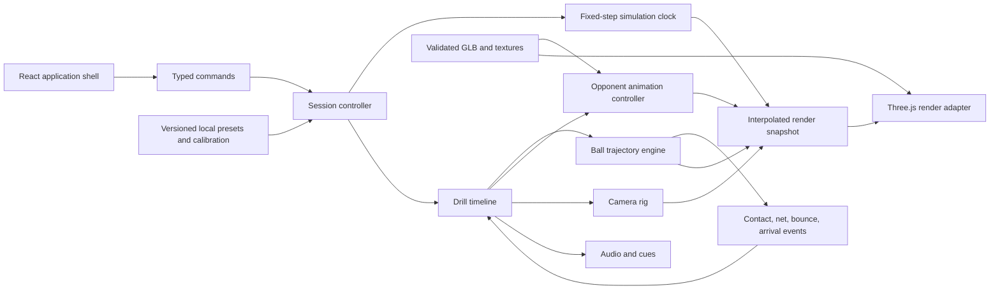

# Technical architecture

- **Status:** Proposed
- **Last updated:** 2026-09-08

## 1. Architectural objective

Build a deterministic tennis rehearsal engine whose ball, opponent, camera, and cues share one timeline while keeping the browser UI, render backend, and future tracking system replaceable.

The system should optimize for perceptual credibility and testability, not for general-purpose game physics.

## 2. Proposed stack

**Motion production update (2026-09-05):** [ADR-0012](decisions/0012-local-opponent-motion-pipeline.md) replaces cloud mocap with local video analysis, constraint correction, and Blender baking in `F:/Codes/Tenmulate_motion_analysis`. Only versioned runtime assets/metadata and the session-time animation controller enter this frontend. Inference is never a browser runtime dependency. The implemented method and current binding contract are in section 8.

| Layer | Proposed choice | Rationale |
| --- | --- | --- |
| App shell | React + TypeScript + Vite | Suitable for setup, drill selection, controls, local editor states, and a static deployment. |
| 3D runtime | Direct Three.js integration behind a typed engine adapter | Keeps the fixed-step simulation and frame lifecycle explicit; avoids sending high-frequency state through React. |
| Renderer | Three.js `WebGLRenderer` with WebGL 2 as the accepted V1 baseline behind a typed scene adapter | This is the verified implementation path; WebGPU remains a later production-asset benchmark rather than a release dependency. |
| Shader/material path | Procedural GLSL layered onto Three.js physical materials | Keeps every venue surface compact, deterministic, dynamically relightable, and compatible with the accepted WebGL 2 baseline. |
| Ball dynamics | Custom fixed-step 3D numerical solver | Tennis needs drag, spin-dependent lift, precise bounce targets, inverse authoring, and deterministic outputs more than general rigid-body contacts. |
| General collision option | Rapier, only if later features need it | Provides WASM, CCD, SI-unit guidance, and cross-platform determinism for collision-heavy extensions. |
| Runtime asset format | glTF/GLB | Designed for runtime delivery and carries meshes, PBR materials, skins, morphs, and animation clips. |
| Environment format | Six Blender-authored venues, each with Quality/Performance GLBs | ADR-0013 replaces procedural venue sketches. Gameplay coordinates, atmosphere, lighting and efficient instanced 2D audiences stay TypeScript-owned. |
| Asset DCC | Blender | Canonical cleanup, scale/orientation, retargeting, animation markers, optimization, and export, regardless of whether the source was modeled, licensed, scanned, or AI-generated. |
| Asset delivery | Hashed static manifests + object/CDN origin candidate | Keeps large optional GLB/animation/venue payloads independently cacheable and lazy-loaded; provider selection follows measured egress/caching tests. |
| Test layers | Vitest-style unit/property tests, browser E2E, frame-time harness, visual snapshots | Separates numerical truth, sequence behavior, runtime behavior, and visual fidelity. Exact test framework is selected during scaffold. |
| V1 persistence | Versioned local JSON + browser storage + service-worker cache | Presets, calibration, custom drills, and selected offline content need no account; keeps public-free V1 deployable as a static application. |

**Gameplay integration update (2026-09-08):** [ADR-0015](decisions/0015-mode-aware-gameplay-rhythm.md) and [ADR-0016](decisions/0016-bounded-rally-arcs-and-drill-pace.md) establish the mode-aware compiler: fixed-home practice, tactical recovery/direct routes, percentage rhythm, calibrated receiver coverage and physically solved return links. All application previews share that compiler. Compiled drill feeds now use fixed-speed angle resolution, while raw legacy asset/physics authoring remains available internally. See the [integration receipt](development/gameplay-rhythm-integration-2026-09-08.md) for the current evidence and limits.

## 3. System boundaries



React owns menus and low-frequency state. The session controller owns active playback. The render adapter reads immutable/interpolated snapshots and never becomes the source of ball truth.

## 4. World model and units

- SI units everywhere: meters, seconds, kilograms, radians.
- Right-handed coordinates:
  - `x`: court width, positive toward court-right as seen by the near player looking toward the opponent; this never depends on user handedness.
  - `y`: vertical, positive upward.
  - `z`: court length, positive from the near baseline toward the opponent.
- Court center at ground level below the net: `(0, 0, 0)`.
- Near baseline at `z = -11.885`; far baseline at `z = +11.885`.
- Singles sidelines at `x = ±4.115`; doubles sidelines at `x = ±5.485`.
- Service lines at `z = ±6.40`.
- Opponent placement extends through the ITF international-competition runoff to `x = ±9.145` and `z = ±18.285`, derived from 3.66 m sideline and 6.40 m baseline clearances. Rally defaults to `(0, 0, 12.885)`, one metre behind the far baseline; serve/net presets keep their authored origins.
- A single validated surface identifier selects the matching visual material and bounce profile. Legacy independent appearance/physics preferences normalize to one canonical value during local-storage loading, with the former physics choice taking precedence when both exist.

All geometry constants live in one tested court-domain module sourced from the current ITF rules and the [2026 ITF technical booklet](https://www.itftennis.com/media/15648/2026-technical-booklet.pdf), Table 5 on pages 43–44.

## 5. Display and camera calibration

For a physically calibrated display, the perspective camera should derive field of view from visible screen height `H` and eye-to-screen distance `D`:

```text
verticalFov = 2 * atan(H / (2 * D))
```

The horizontal field of view follows from aspect ratio. The product should expose:

- **Physical-view mode:** geometry aligns to the user's real viewing cone. This can feel zoomed on smaller screens but preserves scale.
- **Immersive mode:** a user-tunable FOV/zoom prioritizes court awareness and preference over physical 1:1 projection.

Physical calibration is optional because the app must also work when users do not know screen dimensions or viewing distance. Camera location is independent of physical viewer distance. The realistic reset is provisionally 1.70 m eye height, centered, 1.5 m behind the near baseline, level horizon, and a default FOV selected during real-display testing.

Camera positions (eye height plus lateral/longitudinal location) and perspectives (yaw, pitch, and FOV) are separate locally versioned preset collections. Users can combine either collection freely, move the setup camera, update an existing preset in place, or create a new preset. The renderer applies perspective as a local `YXZ` Euler orientation rather than recomputing a look-at point from a fixed court target, so position changes preserve the active aim. Left-button pointer capture accumulates yaw and pitch in 0.1° display increments and wraps each axis through 360°; right-button capture remains reserved for opponent-shot aiming. Wheel input over the court adjusts horizontal FOV through the shared 5°–160° clamp (up narrows/zooms in, down widens/zooms out), prevents page scrolling only while the pointer is on the canvas, and clears the selected perspective preset so the changed view can be saved explicitly. WASD movement derives forward and strafe basis vectors from the active yaw, normalizes diagonal input, then converts world z back into the stored behind-baseline coordinate; Ctrl+W/S reserves the forward axis for bounded 0.4–8.0 m eye-height movement. The top-down opponent planner retains its player-view/world-x conversion independently. Reset applies the first position plus the first perspective; a preference change cannot alter court geometry, shot coordinates, or event timing.

Camera motion uses a rig with separate position and gaze/orientation tracks. It must not parent ball or court coordinates, and it should use capped velocity/acceleration plus reduced-motion alternatives.

## 6. Ball trajectory engine

### 6.1 State

```ts
type BallState = {
  time: number;
  position: Vec3;
  velocity: Vec3;
  angularVelocity: Vec3;
};
```

Shot definitions store an authoring intent and a resolved launch solution. This lets content authors say “land deep cross-court and arrive shoulder-high” while tests preserve the exact resolved parameters.

Quick Practice exposes only a target-practice authoring path: Groundstroke, Serve, Volley, Lob, or Overhead; launch speed; compatible spin type and continuous rpm; landing depth; direction; surface; and cadence. There is no user-facing raw-angle or manual-ballistics mode. A right-button drag is raycast from the current FPV camera onto the regulation court plane and converted through the shared player-view horizontal convention. `ball-v6-spin-target` treats launch speed as an exact magnitude, retains shot-profile net clearance as an internal safety constraint, samples the valid fixed-speed launch-angle envelope, and refines the closest first-bounce target. Groundstroke/Volley prefer the lower matching branch; Lob prefers the high branch; Serve clamps depth and direction inside the diagonally opposite service box. If the selected combination is impossible, the physical closest result is retained without changing speed or fabricating a target hit. Bundled/editor-authored V1 content retains its validated compatibility fields internally, but does not add a second Quick Practice control mode. Both paths use the same forces, bounce profiles, and event reporting.

The four left-rail setup presets compose camera and feed choices rather than naming the opponent's stroke in every case. In particular, Volley selects the `position-net` user camera plus the standard behind-baseline Groundstroke profile. Choosing Volley in the explicit Shot type control remains the separate authoring path for a spin-free opponent volley from near the net.

### 6.2 Free-flight forces

The `ball-v6-spin-target` solver applies:

- gravity `m * g`;
- drag opposite the velocity vector, proportional to `0.5 * Cd * rho * A * v²`;
- Magnus lift perpendicular to velocity and spin axes, proportional to `0.5 * Cl * rho * A * v²`;
- quadratic drag and Magnus force relative to the configured world-space wind velocity; calm air remains the compatibility default.

Wind direction is stored in the player-facing court frame: `0 degrees` moves air toward `+z` and `90 degrees` toward `+x`. The authoring solver finds the calm-air launch required for the intended target, then runtime air-relative forces apply the configured wind. This deliberately makes wind move the visible bounce/arrival instead of silently re-aiming every opponent shot.

The implementation uses a 57.7 g, 67 mm ball, `Cd = 0.55`, and `Cl = min(0.35, 0.6 S)`, where `S = Rω/v`. Spin type supplies shot-local topspin and side-spin axes that rotate with launch heading; continuous rpm supplies their normalized magnitude. A Flat groundstroke is a low-topspin drive with a 760 rpm default and a non-zero 250–1,600 rpm control range, not a spin-free projectile. Flat, slice, and kick serve defaults approximate measured magnitudes of 123, 232, and 337 rad/s. Volley spin is always zero; Lob uses a lower-spin high-arc family so it does not inherit the ordinary groundstroke spin magnitude. Free-flight angular speed currently decays about 2% per 6.4 m. These constants, their source evidence, and remaining calibration limits are recorded in [Ball flight and impact calibration](research/ball-flight-impact-calibration.md).

### 6.3 Integration and events

- Fixed 1/240 s semi-implicit integration; endpoint, legality, determinism, and post-bounce invariants are covered by checked-in tests, while a high-resolution research comparison remains an external calibration gate.
- Rendering interpolates between simulation states and does not advance the physics clock directly.
- Court and net intersections are solved within a step instead of waiting for a sampled point to cross a plane.
- Ball launch, net crossing/contact, court bounce, receiver-plane crossing, and shot completion are timestamped events.
- Receiver-plane crossing is diagnostic, not terminal. Samples continue through repeated bounce/ground motion for at least three seconds after first ground contact; interval-based preview launches use a small shared-geometry ball pool so a new launch never truncates an earlier ball.
- Spin decays continuously with distance before impact; the current 2% per 6.4 m coefficient remains an instrumented-calibration gate.
- The renderer projects immutable trajectory samples into screen space for hover hit-testing. The tooltip interpolates the nearest sample and derives angle, apex, net clearance, landing error, bounce speeds, and receiver state without changing the simulation clock or React becoming the source of ball truth.

The 2026 trajectory paper used 0.0001 s for research fitting and found increased fit error at 0.001 s. A consumer runtime can use a coarser step only after endpoint and timing error are measured against the reference solver.

### 6.4 Bounce model

Bounce is a discontinuity between two free-flight arcs. A surface profile provides:

```ts
type SurfacePhysics = {
  id: string;
  normalRestitution: number;
  friction: number;
  rollingResistance: number;
};
```

Impact uses a `0.55 mR²` tennis-ball inertia model. It computes contact-point slip, caps the tangential impulse with Coulomb friction, transfers that impulse into both horizontal and angular velocity, and applies a bounded impact-speed correction to normal restitution. Hard, clay, and grass provide separate restitution, friction, and rolling resistance. The natural profile is resolved first; an optional Quick Practice factor then multiplies only the first rebound's normal velocity from 0.60× to 1.40×. Product-facing labels distinguish the 1.00× research-calibrated baseline from this explicit perceptual adjustment.

### 6.5 Inverse authoring

An offline authoring solver searches launch heading/elevation/speed/spin within declared bounds to satisfy:

- intended landing point/zone;
- net clearance range;
- maximum launch-speed and spin profile;
- desired bounce height or receiver-plane arrival window;
- service-box legality for serves.

Resolved shots are checked into source as versioned JSON. Runtime playback does not perform an expensive unconstrained optimizer.

### 6.6 Determinism

- Scenario definitions include schema version, solver version, surface profile, and random seed.
- Random variations use a seeded PRNG and named ranges.
- Golden snapshots record event timestamps and selected samples, not every render frame.
- No outcome depends on display refresh rate, React render timing, or animation frame drops.

## 7. Drill timeline

One declarative timeline coordinates all domains:

```ts
type DrillEvent =
  | { at: number; type: "opponent.clip"; clip: string; position?: { x: number; z: number }; playbackRate?: number; opponentHand?: "left" | "right" }
  | { at: number; type: "ball.launch"; shotId: string }
  | { at: number; type: "camera.path"; pathId: string }
  | { at: number; type: "cue.play"; cueId: string }
  | { at: number; type: "rest"; duration: number };
```

In practice, `ball.launch` is anchored to a named animation contact marker rather than a separately hand-entered timestamp. The compiled runtime timeline contains absolute event times and rejects missing/ambiguous markers.

State machine outline:

```text
idle -> loading -> ready -> countdown -> playing -> interval -> playing
                                  |          |           |
                                  +------ paused <-------+
                                             |
                                      completed/error
```

Pause freezes the session clock, animation mixer, ball, camera, and cues as one operation.

## 8. Opponent animation architecture

### 8.1 Runtime model

- One canonical humanoid skeleton per opponent family.
- Skinned mesh and reusable animation clips in GLB.
- `AnimationMixer`/actions for clip playback, fades, warps, and recovery blends.
- Root-motion strategy decided per clip: extract root translation into the opponent controller or keep animation in-place and animate root separately; never mix strategies accidentally.
- Racket is attached to a named hand/socket bone and is visible for the opponent.
- Each stroke clip has sidecar metadata or exported extras for preparation start, contact, follow-through, recoverable end, opponent handedness, and valid playback-rate range.
- Both opponent hands are represented by accepted distinct clips or by a mirror transform that has separately passed biomechanics, racket-hand, root-motion, and contact review.
- Serve clips add `serveRhythm: "normal" | "compact"`, toss-release/trophy/contact markers, and rhythm-specific playback bounds. Serve rhythm is not encoded in the ball-speed field.

### 8.2 Contact quality gate

At the marker frame:

- racket string-bed center is within the agreed distance of the launch point;
- racket orientation and ball initial direction are plausible;
- foot plant/root location match the authored court contact position;
- no clip-rate change makes movement visibly unnatural;
- camera review at normal speed and frame step both pass.

### 8.3 Asset pipeline

ADR-0013 extends the earlier Blender pilots to all six built-in venues and removes procedural venue presentation. Source, provenance, reproducible builds, variant budgets and seated audiences are documented in [Six authored venues](development/indoor-venues-and-performance.md). The visible court/net is authored in GLB, while regulation coordinates and gameplay authority stay in TypeScript. Each manager validates requested ID, hash, size and independent gameplay anchors. A failed/unavailable asset shows a retryable error, not a different venue.

Motion production uses the independent local laboratory under ADR-0012; the current
model/library contract is [ADR-0014](decisions/0014-articulated-player-and-complete-motion-library.md).
The [motion runbook](development/local-motion-pipeline.md) is the operational authority.

1. Inspect owner-supplied footage and record performer, view, source cadence and phase uncertainty.
2. Author joint-space controls with anatomical constraints, keeping fixed segments and rigid grips.
3. Bind the CC0 articulated mannequin to the established tennis armature; bake all 24 clips at 120 Hz.
4. Validate exported transforms at 240 Hz, including contact, grip, stance and interval continuity.
5. Publish the immutable combined model/motion GLB with matching provenance, clocks and calibration.
6. Verify the actual frontend rig after blending/IK for both hands, then visually review playback.

Recipes and source configuration are editable authority; Blender masters are reproducible
outputs. Optional local pose extraction is diagnostic only. Cloud inference is not a
production prerequisite, and no inference or reference-video fetch occurs during practice.

### 8.4 Motion and character binding contract

- The active 1.88 m articulated mannequin uses vertex-colored neutral panels and dark joints
  on the existing 65-bone skeleton. Its source pack's animations are not imported.
- Gameplay loads one hashed GLB containing the skinned model, separate rigid racket and
  24 animation clips. The static carrier remains a build/provenance resource.
- `src/content/opponent-motion.json` selects the runtime asset, clock and calibration;
  `opponent-asset.json` selects model identity. Publication and the frontend integration
  check enforce agreement with the published manifest.
- The absolute session clock samples baked clips and the shared root-recovery planner.
  Distance controls step cadence. Foot IK preserves knee planes; hand grips remain rigid.
- `serve` and `serve-compact` are separate normal-rate clips. The selected release/contact
  anchors drive a ballistic toss; outgoing ball physics remains independent of rhythm.
- Groundstrokes, slices and volleys have dedicated clips. Half-volley, overhead and
  one-handed-backhand labels retain documented proxies.
- The build precaches the active combined opponent bundle only. Retained historical
  bundles are not required offline downloads.
- Technique acceptance requires normal-speed and phase-frame visual review in addition
  to mechanics checks. Public source/provenance and target-device review remain release gates.

Earlier provider comparisons are historical research in
[Mocap to web opponent](research/mocap-to-web-character-pipeline.md).

## 9. Rendering architecture

- The renderer adapter owns initialization, resize, pixel ratio, render passes, color management, and capability reporting.
- The scene layer owns regulation court geometry, net, ball, opponent, lighting, venue adapters, and debug overlays.
- Standard PBR materials first. Custom effects must work on the chosen backend path or have a tested accessible fallback.
- Gameplay visibility materials are renderer-owned. The ball uses one shared optic yellow-green PBR material for every overlapping instance; the opponent uses vertex-colored neutral panels/dark joints plus back-face outline clones bound to the source skinned meshes and skeletons; legacy uncolored carriers use a shared white fill. The outline writes no depth or shadow and never enters physics or collision state.
- External asset loading is manifest-driven with explicit URL, byte size, hash, cache group, version, compatible skeleton/content versions, and a progress/error state.
- The critical route loads UI, the selected Blender venue variant, ball and drill. Quality/Performance selection precedes GLB download; only one complete venue remains CPU/GPU-resident. Deselecting aborts transfers and releases completed geometry/materials/textures. Late parses are disposed. Invalid assets show retryable loading errors, with no procedural substitute.
- Six authored identities cover hard, clay and grass variants of Outdoor Arena and Indoor Court. Packed Blender masters own architecture, access, seating, court/net, furniture and aligned fixture anchors. Separate low-detail exports retain registration, roof silhouette and seat positions while simplifying secondary detail, seats, nets and textures.
- One renderer-owned atmosphere uses Three.js `Sky`, directional sun, hemispheric fill, fog, and a PMREM environment map. Time of day and light direction drive the solar state; clear/overcast/rain weather drives scattering, diffusion, fog, precipitation, and procedural wetness. Indoor halls hide the outdoor atmosphere, use four fixture-aligned lights and one lazily generated, cached PMREM room environment for bounce fill.
- `venueLighting.ts` resolves one art-directed schedule for the sky, direct key, fill, environment, exposure and court fixtures across every venue. Day emphasizes directional roof/bowl shadows; dusk overlaps warm raking sunlight and floodlights without an unlit interval. Quality uses a 4096-pixel venue-wide directional shadow map; Auto/Performance use 2048, within device limits. The authored roof uses double-sided shadow casting without changing visible culling. Baked neutral AO supplies local contact depth, not directional light or full dynamic global illumination.
- Native venue appearance uses exported PBR, original surface/wood/mineral maps, CC0 concrete where documented, and neutral baked local occlusion. Wetness updates PBR roughness; optional alternate playing surfaces borrow renderer-owned procedural materials without transferring ownership. No procedural venue geometry remains.
- Meshopt and WebP delivery is lazy. Large GLBs and audience assets stay outside shell precache. Runtime cache bounds are twelve visited GLB URLs, six network-first manifests, and ten audience resources. Content hashes and byte budgets are verified before reveal.
- Optional seated audiences use generated front/back atlases on spatially chunked instanced cards with opaque depth writes and GPU chroma-key cutout. Each person has two triangles, no skeleton or per-frame CPU work. Empty unloads/fetches nothing; Half is an exact stable subset of Full. Quality uses 1024 px artwork and subtle sway; Performance uses 512 px static artwork; reduced-motion preference disables sway.
- Weather does not change bounce physics in V1. Wind changes air-relative drag and Magnus force; lighting and wetness remain presentation-only. Any future wet-court physics must be an explicit, calibrated surface profile.
- Adaptive quality can lower pixel ratio, shadow map resolution, anisotropy, texture resolution, post-processing, and venue detail. It cannot reduce simulation frequency or change shot outcomes.

Provisional, benchmark-only delivery budgets are no more than 5 MiB compressed for the initial application, canonical court modules, and local texture path, and no more than 15 MiB additional data to start the first neutral-opponent drill. The current combined opponent library is about 2.85 MiB and is precached; measured first-use and warm-cache behavior, not retained historical repository assets, determines acceptance.

### 9.1 Future renderer reassessment matrix

After the production opponent and venue representation are selected, benchmark the same representative scene using:

1. Three.js `WebGPURenderer` with WebGPU.
2. The same renderer forced to its WebGL 2 backend.
3. Three.js `WebGLRenderer` if API/material parity allows a fair comparison.
4. A production-density Three.js scene with the neutral humanoid and representative mocap clips.

Capture initialization success, first frame, CPU/GPU frame time, dropped frames, memory, visual differences, shader/material gaps, and screenshot evidence on the supported browser/device matrix. Keep the accepted V1 WebGL 2 path unless another renderer produces a material, repeatable product benefit without losing browser or asset compatibility.

### 9.2 Canonical scene composition

Each `SceneDefinitionV1` selects reusable TypeScript builders for ground/runoff, enclosure, seating, architecture, access, lighting fixtures, vegetation, and court furniture. Builders return owned Three.js groups plus material handles and quality tags. Surface colors/textures are applied through a separate court-material controller, while environment selection controls only venue composition and presentation lighting.

Procedural texture factories generate repeatable color/roughness/normal-scale cues locally and cache by descriptor. Repeated seating, fence posts, lamps, roof members, and planting use instancing or shared geometries/materials. Every group participates in one disposal registry so scene switching cannot leak GPU resources.

Generated-world coordinates, splat renderers, panoramas, provider iframes, and interactive world models are prohibited in the runtime. The old alternatives remain documented in the dated research note and superseded ADR-0004.

## 10. React integration

- React creates the canvas host and sends typed commands to a long-lived engine instance.
- High-frequency transforms stay in engine-owned typed structures; React receives throttled status summaries.
- Global product state is divided into configuration, content selection, session status, and diagnostics.
- The V1 drill editor edits immutable versioned definitions and compiles/validates them before playback.
- Error boundaries and a renderer boot failure screen remain usable without the canvas.

## 11. Data contracts and persistence

Proposed top-level records:

- `AppCalibrationV1`
- `SurfaceProfileV1`
- `ShotDefinitionV1`
- `ResolvedTrajectoryV1`
- `OpponentClipMetadataV1`
- `CameraPathV1`
- `DrillDefinitionV1`
- `AssetManifestV1`

All records have an explicit schema version. Bundled content definitions are immutable build assets; camera-position and perspective preset instances are locally customizable. Legacy coupled saved views migrate into the two independent preset collections, and the former on-court Rally default migrates to the one-metre runback. User-created drills are copies with separate IDs, and each event may store an opponent floor position validated against the ITF competition runoff. JSON import rejects executable content, unknown remote asset references, out-of-envelope positions, and incompatible schema versions.

V1 stores calibration, preferences, custom drills, and offline-content selection locally. A service worker precaches the shell and explicitly selected drill asset groups, exposes storage/cache state, and degrades clearly when storage quota prevents an offline promise. No personal data leaves the device unless an explicitly initiated export or a later separately approved analytics/account feature does so.

## 12. Future body-tracking boundary

The tracking layer must eventually emit normalized product events rather than mutate the scene directly:

```ts
type PlayerTrackingFrame = {
  timestamp: number;
  confidence: number;
  rootPosition?: Vec3;
  landmarks?: readonly Landmark3D[];
};
```

MediaPipe Pose Landmarker is a plausible browser candidate because it outputs 33 image/world landmarks. Its web calls are synchronous and can block the main thread, so any spike should use a worker and measure contention with rendering. Camera access requires HTTPS/localhost and explicit user permission. The eventual tracking adapter can influence camera/timeline behavior only through timestamped confidence-bearing commands with bounded latency and safe fallback. This is the defining V2 investigation, not a hidden V1 dependency.

## 13. Verification strategy

### Numerical tests

- Regulation court constants and zone containment.
- Gravity-only analytic sanity checks.
- Drag/Magnus reference trajectories.
- Exact court/net event solving.
- Bounce conservation/loss bounds and surface ordering.
- Same shot/seed across 30, 60, and 120 Hz render harnesses.
- Inverse solver net clearance and landing tolerance.

### Timeline tests

- Contact marker compiles to launch timestamp.
- Pause/resume freezes every subsystem.
- Seeded variations remain inside declared ranges.
- Invalid/missing assets and markers fail before a drill starts.

### Asset tests

- GLB loads, has the expected skeleton/bones/clips, stays within agreed triangle/texture budgets, and contains no unlicensed embedded data.
- Animation contact position and foot-slide thresholds.
- Texture formats and color-space declarations.
- Venue assets register to court anchors, respect the central mask, expose valid proxy/depth data, declare lighting limits, and contain no generated court geometry used as collision authority.

### Browser and performance tests

- Primary drill flow, full screen, pause/restart, settings, and renderer fallback.
- Chrome/Edge Windows reference; Safari macOS and Firefox Windows validation across agreed low/mid/high device tiers rather than one universal hardware promise.
- 1080p, 1440p, and 4K/adaptive resolution captures.
- 30-minute soak, context loss/recovery where feasible, tab visibility pause/resume, and reduced motion.
- Performance artifacts include frame-time percentiles and renderer/backend/hardware metadata.

### Visual fidelity tests

Before UI implementation, approve a complete primary-screen concept and key states. Compare browser screenshots with that concept at matching dimensions and record copy, layout, typography, palette, court/asset treatment, responsive behavior, and interaction deviations.

## 14. Proposed repository structure after the technical spike

```text
src/
  app/                 React shell and routes
  calibration/         Physical display and POV setup
  content/             Versioned shot, drill, surface, and camera definitions
  engine/
    clock/
    session/
    timeline/
    trajectory/
    animation/
    camera/
    audio/
    rendering/
  assets/              Runtime manifests, cache groups, and generated bindings
  diagnostics/         Debug overlay and evidence capture
tests/
  numerical/
  integration/
  browser/
tools/
  trajectory-authoring/
  asset-validation/
  asset-bakeoff/
public/
  assets/
docs/
```

The exact scaffold is intentionally deferred until the visual, asset, and technical spikes prevent premature dependencies from becoming architecture.
