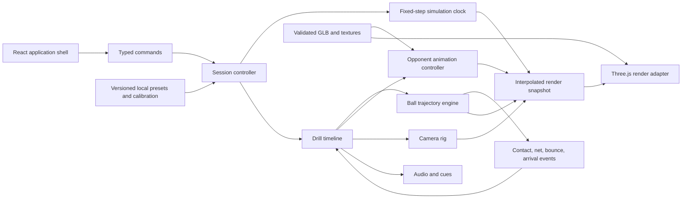

# Technical architecture

- **Status:** Proposed
- **Last updated:** 2026-08-29

## 1. Architectural objective

Build a deterministic tennis rehearsal engine whose ball, opponent, camera, and cues share one timeline while keeping the browser UI, render backend, and future tracking system replaceable.

The system should optimize for perceptual credibility and testability, not for general-purpose game physics.

## 2. Proposed stack

| Layer | Proposed choice | Rationale |
| --- | --- | --- |
| App shell | React + TypeScript + Vite | Suitable for setup, drill selection, controls, local editor states, and a static deployment. |
| 3D runtime | Direct Three.js integration behind a typed engine adapter | Keeps the fixed-step simulation and frame lifecycle explicit; avoids sending high-frequency state through React. |
| Renderer | Three.js `WebGLRenderer` with WebGL 2 as the accepted V1 baseline behind a typed scene adapter | This is the verified implementation path; WebGPU remains a later production-asset benchmark rather than a release dependency. |
| Shader/material path | Standard Three.js materials; avoid unnecessary renderer-specific hooks | Keeps the production surface modest and leaves a bounded future WebGPU migration path. |
| Ball dynamics | Custom fixed-step 3D numerical solver | Tennis needs drag, spin-dependent lift, precise bounce targets, inverse authoring, and deterministic outputs more than general rigid-body contacts. |
| General collision option | Rapier, only if later features need it | Provides WASM, CCD, SI-unit guidance, and cross-platform determinism for collision-heavy extensions. |
| Runtime asset format | glTF/GLB | Designed for runtime delivery and carries meshes, PBR materials, skins, morphs, and animation clips. |
| Environment format | Typed Three.js composition modules plus local procedural texture maps | ADR-0005 removes generated worlds and splats; exact geometry, materials, props, and lighting stay code-owned. |
| Asset DCC | Blender | Canonical cleanup, scale/orientation, retargeting, animation markers, optimization, and export, regardless of whether the source was modeled, licensed, scanned, or AI-generated. |
| Asset delivery | Hashed static manifests + object/CDN origin candidate | Keeps large optional GLB/animation/venue payloads independently cacheable and lazy-loaded; provider selection follows measured egress/caching tests. |
| Test layers | Vitest-style unit/property tests, browser E2E, frame-time harness, visual snapshots | Separates numerical truth, sequence behavior, runtime behavior, and visual fidelity. Exact test framework is selected during scaffold. |
| V1 persistence | Versioned local JSON + browser storage + service-worker cache | Presets, calibration, custom drills, and selected offline content need no account; keeps public-free V1 deployable as a static application. |

## 3. System boundaries



React owns menus and low-frequency state. The session controller owns active playback. The render adapter reads immutable/interpolated snapshots and never becomes the source of ball truth.

## 4. World model and units

- SI units everywhere: meters, seconds, kilograms, radians.
- Right-handed coordinates:
  - `x`: court width, positive toward court-right as seen by the near player looking toward the opponent; this never depends on user handedness.
  - `y`: vertical, positive upward.
  - `z`: court length, positive from the near baseline toward the opponent.
- Court center at ground level below the net: `(0, 0, 0)`.
- Near baseline at `z = -11.885`; far baseline at `z = +11.885`.
- Singles sidelines at `x = ±4.115`; doubles sidelines at `x = ±5.485`.
- Service lines at `z = ±6.40`.
- Physics surfaces and visual materials have different identifiers. A blue hard-court appearance cannot silently imply a particular bounce profile.

All geometry constants live in one tested `courtDimensions` module sourced from the current ITF rules.

## 5. Display and camera calibration

For a physically calibrated display, the perspective camera should derive field of view from visible screen height `H` and eye-to-screen distance `D`:

```text
verticalFov = 2 * atan(H / (2 * D))
```

The horizontal field of view follows from aspect ratio. The product should expose:

- **Physical-view mode:** geometry aligns to the user's real viewing cone. This can feel zoomed on smaller screens but preserves scale.
- **Immersive mode:** a user-tunable FOV/zoom prioritizes court awareness and preference over physical 1:1 projection.

Physical calibration is optional because the app must also work when users do not know screen dimensions or viewing distance. Camera location is independent of physical viewer distance. The realistic reset is provisionally 1.70 m eye height, centered, 1.5 m behind the near baseline, level horizon, and a default FOV selected during real-display testing.

Users can independently adjust/save eye height, lateral/longitudinal position, yaw, pitch/look target, FOV/zoom, and camera-motion intensity. A preference change cannot alter court geometry, shot coordinates, or event timing. Calibration and view settings are versioned locally and included in explicit diagnostic exports.

Camera motion uses a rig with separate position and gaze/orientation tracks. It must not parent ball or court coordinates, and it should use capped velocity/acceleration plus reduced-motion alternatives.

## 6. Ball trajectory engine

### 6.1 State

```ts
type BallState = {
  time: number;
  position: Vec3;
  velocity: Vec3;
  angularVelocity: Vec3;
};
```

Shot definitions store an authoring intent and a resolved launch solution. This lets content authors say “land deep cross-court and arrive shoulder-high” while tests preserve the exact resolved parameters.

### 6.2 Free-flight forces

The provisional solver applies:

- gravity `m * g`;
- drag opposite the velocity vector, proportional to `0.5 * Cd * rho * A * v²`;
- Magnus lift perpendicular to velocity and spin axes, proportional to `0.5 * Cl * rho * A * v²`;
- optional wind only after the no-wind model is validated.

The current research supports treating drag coefficient as constant over one arc and lift coefficient as a function of spin parameter for the normal tennis range. Those values must be calibration data, not scattered magic constants.

### 6.3 Integration and events

- Fixed simulation step; initial spike compares 1/240 s and 1/480 s RK4 or an equivalent stable integrator against high-resolution golden trajectories.
- Rendering interpolates between simulation states and does not advance the physics clock directly.
- Court and net intersections are solved within a step instead of waiting for a sampled point to cross a plane.
- Ball launch, net crossing/contact, court bounce, receiver-plane crossing, and shot completion are timestamped events.
- Spin decay can initially be constant per flight arc, then refined from validation evidence.

The 2026 trajectory paper used 0.0001 s for research fitting and found increased fit error at 0.001 s. A consumer runtime can use a coarser step only after endpoint and timing error are measured against the reference solver.

### 6.4 Bounce model

Bounce is a discontinuity between two free-flight arcs. A surface profile provides:

```ts
type SurfacePhysics = {
  id: string;
  normalRestitution: number;
  tangentialFriction: number;
  spinCoupling: number;
  paceCategory?: 1 | 2 | 3 | 4 | 5;
  provenance: string;
};
```

Initial values are calibrated to ITF ball rebound ranges and Court Pace Rating test concepts, then tuned with recorded trajectory references. Product-facing labels distinguish measured/calibrated profiles from illustrative ones.

### 6.5 Inverse authoring

An offline authoring solver searches launch heading/elevation/speed/spin within declared bounds to satisfy:

- intended landing point/zone;
- net clearance range;
- maximum launch-speed and spin profile;
- desired bounce height or receiver-plane arrival window;
- service-box legality for serves.

Resolved shots are checked into source as versioned JSON. Runtime playback does not perform an expensive unconstrained optimizer.

### 6.6 Determinism

- Scenario definitions include schema version, solver version, surface profile, and random seed.
- Random variations use a seeded PRNG and named ranges.
- Golden snapshots record event timestamps and selected samples, not every render frame.
- No outcome depends on display refresh rate, React render timing, or animation frame drops.

## 7. Drill timeline

One declarative timeline coordinates all domains:

```ts
type DrillEvent =
  | { at: number; type: "opponent.clip"; clip: string; playbackRate?: number; opponentHand?: "left" | "right" }
  | { at: number; type: "ball.launch"; shotId: string }
  | { at: number; type: "camera.path"; pathId: string }
  | { at: number; type: "cue.play"; cueId: string }
  | { at: number; type: "rest"; duration: number };
```

In practice, `ball.launch` is anchored to a named animation contact marker rather than a separately hand-entered timestamp. The compiled runtime timeline contains absolute event times and rejects missing/ambiguous markers.

State machine outline:

```text
idle -> loading -> ready -> countdown -> playing -> interval -> playing
                                  |          |           |
                                  +------ paused <-------+
                                             |
                                      completed/error
```

Pause freezes the session clock, animation mixer, ball, camera, and cues as one operation.

## 8. Opponent animation architecture

### 8.1 Runtime model

- One canonical humanoid skeleton per opponent family.
- Skinned mesh and reusable animation clips in GLB.
- `AnimationMixer`/actions for clip playback, fades, warps, and recovery blends.
- Root-motion strategy decided per clip: extract root translation into the opponent controller or keep animation in-place and animate root separately; never mix strategies accidentally.
- Racket is attached to a named hand/socket bone and is visible for the opponent.
- Each stroke clip has sidecar metadata or exported extras for preparation start, contact, follow-through, recoverable end, opponent handedness, and valid playback-rate range.
- Both opponent hands are represented by accepted distinct clips or by a mirror transform that has separately passed biomechanics, racket-hand, root-motion, and contact review.
- Serve clips add `serveRhythm: "normal" | "compact"`, toss-release/trophy/contact markers, and rhythm-specific playback bounds. Serve rhythm is not encoded in the ball-speed field.

### 8.2 Contact quality gate

At the marker frame:

- racket string-bed center is within the agreed distance of the launch point;
- racket orientation and ball initial direction are plausible;
- foot plant/root location match the authored court contact position;
- no clip-rate change makes movement visibly unnatural;
- camera review at normal speed and frame step both pass.

### 8.3 Asset pipeline

1. Build exact court, net, ball, target-zone, trajectory/debug, and simple modular venue primitives directly in code where parametric precision and tiny payloads are valuable.
2. Acquire, commission, model, scan, or generate a licensed game-realistic base character; record provider/model/version, prompts/references, input rights, output terms, and provenance.
3. Normalize topology, separate materials/parts as needed, build/normalize the rig, and set meters/axes in Blender.
4. Capture tennis-specific motion from licensed footage or mocap. AI auto-rigging/video/text motion is candidate production tooling, not acceptance evidence.
5. Retarget and hand-clean feet, hips, shoulders, racket hand, non-racket arm, toss, trophy position, contact, follow-through, and recovery.
6. Bake one action per named clip and add contact/rhythm/hand metadata.
7. Export GLB, validate in an independent glTF viewer, optimize geometry and KTX2/Basis textures, and run the in-app asset validator.
8. Preserve `.blend`, source material/license records, generation/capture receipts, export preset/version, and final GLB/content hashes.

Source selection is made through the standardized bake-off in the 2026 AI 3D research note. Blender is the canonical finishing/source-of-truth environment; Blender MCP, if used, is an isolated local productivity helper and never part of the runtime.

The accepted authoring constraint is cloud inference only: no local 3D or mocap model will be installed or run. Local Blender cleanup, retargeting, inspection, and deterministic export remain allowed because they are DCC production steps, not model inference. Runtime assets are hosted by the project under immutable URLs; provider generation endpoints are never called during a practice session.

### 8.4 Mocap and character binding contract

- A shippable opponent is a skinned mesh: topology + UV/PBR materials + canonical armature + skin weights.
- Cloud mocap output is source-skeleton animation data, normally FBX/BVH and sometimes GLB. It is retargeted and baked onto the canonical target armature; the source skeleton is not a runtime dependency.
- The first slice uses one combined opponent GLB with ready, right-handed forehand, right-handed backhand, normal-serve, and essential footwork/recovery connector actions. Compact serve follows once this retarget/blend chain passes and remains mandatory for V1. Split appearance/animation bundles only after a measured caching benefit and exact skeleton-version checks.
- The racket is a separate rigid GLB prop attached to a named right- or left-hand socket; it is not fused into or skin-weighted with the character body.
- Rackets are rigid props attached to named left/right hand sockets. A serve ball follows a kinematic toss through the toss/contact markers, then transfers to the deterministic trajectory solver at contact.
- Root motion, foot plants, toss, trophy, contact, and recovery are explicitly authored metadata. Normal-speed and frame-step tennis review are both required.
- Professional match footage may be used as view-only reference. Cloud motion extraction requires documented download, upload, derivative-use, likeness, and commercial rights; public availability alone does not satisfy that gate.

The full contract and provider comparison are in [Mocap to web opponent](research/mocap-to-web-character-pipeline.md).

## 9. Rendering architecture

- The renderer adapter owns initialization, resize, pixel ratio, render passes, color management, and capability reporting.
- The scene layer owns regulation court geometry, net, ball, opponent, lighting, venue adapters, and debug overlays.
- Standard PBR materials first. Custom effects must work on the chosen backend path or have a tested accessible fallback.
- External asset loading is manifest-driven with explicit URL, byte size, hash, cache group, version, compatible skeleton/content versions, and a progress/error state.
- The critical route loads UI, the selected typed Three.js venue composition, court, ball, and drill first. Only the neutral opponent mesh and animation bundles are external lazy GLB assets.
- Build six scene identities from shared composition modules and combine them with independently selected hard, clay, and grass surfaces. Each scene owns context, seating, access, architecture, landscape, and lighting fixtures; exact court/net and near-court props remain separately testable groups.
- Outdoor lighting exposes sun azimuth/elevation plus day/night/floodlight presets. Indoor lighting exposes fixture intensity/color plus optional window/skylight/roof daylight contribution. Lighting never changes surface physics or event timing.
- Adaptive quality can lower pixel ratio, shadow map resolution, anisotropy, texture resolution, post-processing, and venue detail. It cannot reduce simulation frequency or change shot outcomes.

Provisional, benchmark-only delivery budgets are no more than 5 MiB compressed for the initial application, canonical court modules, and local texture path, and no more than 15 MiB additional data to start the first neutral-opponent drill. The complete animation library may be much larger because it is split, lazy-loaded, and cached; measured first-use and warm-cache behavior, not total repository size, determines acceptance.

### 9.1 Future renderer reassessment matrix

After the production opponent and venue representation are selected, benchmark the same representative scene using:

1. Three.js `WebGPURenderer` with WebGPU.
2. The same renderer forced to its WebGL 2 backend.
3. Three.js `WebGLRenderer` if API/material parity allows a fair comparison.
4. A production-density Three.js scene with the neutral humanoid and representative mocap clips.

Capture initialization success, first frame, CPU/GPU frame time, dropped frames, memory, visual differences, shader/material gaps, and screenshot evidence on the supported browser/device matrix. Keep the accepted V1 WebGL 2 path unless another renderer produces a material, repeatable product benefit without losing browser or asset compatibility.

### 9.2 Canonical scene composition

Each `SceneDefinitionV1` selects reusable TypeScript builders for ground/runoff, enclosure, seating, architecture, access, lighting fixtures, vegetation, and court furniture. Builders return owned Three.js groups plus material handles and quality tags. Surface colors/textures are applied through a separate court-material controller, while environment selection controls only venue composition and presentation lighting.

Procedural texture factories generate repeatable color/roughness/normal-scale cues locally and cache by descriptor. Repeated seating, fence posts, lamps, roof members, and planting use instancing or shared geometries/materials. Every group participates in one disposal registry so scene switching cannot leak GPU resources.

Generated-world coordinates, splat renderers, panoramas, provider iframes, and interactive world models are prohibited in the runtime. The old alternatives remain documented in the dated research note and superseded ADR-0004.

## 10. React integration

- React creates the canvas host and sends typed commands to a long-lived engine instance.
- High-frequency transforms stay in engine-owned typed structures; React receives throttled status summaries.
- Global product state is divided into configuration, content selection, session status, and diagnostics.
- The V1 drill editor edits immutable versioned definitions and compiles/validates them before playback.
- Error boundaries and a renderer boot failure screen remain usable without the canvas.

## 11. Data contracts and persistence

Proposed top-level records:

- `AppCalibrationV1`
- `SurfaceProfileV1`
- `ShotDefinitionV1`
- `ResolvedTrajectoryV1`
- `OpponentClipMetadataV1`
- `CameraPathV1`
- `DrillDefinitionV1`
- `AssetManifestV1`

All records have an explicit schema version. Bundled presets are immutable build assets; user-created drills are copies with separate IDs. Migrations are tested before enabling persistent custom content. JSON import rejects executable content, unknown remote asset references, and incompatible schema versions.

V1 stores calibration, preferences, custom drills, and offline-content selection locally. A service worker precaches the shell and explicitly selected drill asset groups, exposes storage/cache state, and degrades clearly when storage quota prevents an offline promise. No personal data leaves the device unless an explicitly initiated export or a later separately approved analytics/account feature does so.

## 12. Future body-tracking boundary

The tracking layer must eventually emit normalized product events rather than mutate the scene directly:

```ts
type PlayerTrackingFrame = {
  timestamp: number;
  confidence: number;
  rootPosition?: Vec3;
  landmarks?: readonly Landmark3D[];
};
```

MediaPipe Pose Landmarker is a plausible browser candidate because it outputs 33 image/world landmarks. Its web calls are synchronous and can block the main thread, so any spike should use a worker and measure contention with rendering. Camera access requires HTTPS/localhost and explicit user permission. The eventual tracking adapter can influence camera/timeline behavior only through timestamped confidence-bearing commands with bounded latency and safe fallback. This is the defining V2 investigation, not a hidden V1 dependency.

## 13. Verification strategy

### Numerical tests

- Regulation court constants and zone containment.
- Gravity-only analytic sanity checks.
- Drag/Magnus reference trajectories.
- Exact court/net event solving.
- Bounce conservation/loss bounds and surface ordering.
- Same shot/seed across 30, 60, and 120 Hz render harnesses.
- Inverse solver net clearance and landing tolerance.

### Timeline tests

- Contact marker compiles to launch timestamp.
- Pause/resume freezes every subsystem.
- Seeded variations remain inside declared ranges.
- Invalid/missing assets and markers fail before a drill starts.

### Asset tests

- GLB loads, has the expected skeleton/bones/clips, stays within agreed triangle/texture budgets, and contains no unlicensed embedded data.
- Animation contact position and foot-slide thresholds.
- Texture formats and color-space declarations.
- Venue assets register to court anchors, respect the central mask, expose valid proxy/depth data, declare lighting limits, and contain no generated court geometry used as collision authority.

### Browser and performance tests

- Primary drill flow, full screen, pause/restart, settings, and renderer fallback.
- Chrome/Edge Windows reference; Safari macOS and Firefox Windows validation across agreed low/mid/high device tiers rather than one universal hardware promise.
- 1080p, 1440p, and 4K/adaptive resolution captures.
- 30-minute soak, context loss/recovery where feasible, tab visibility pause/resume, and reduced motion.
- Performance artifacts include frame-time percentiles and renderer/backend/hardware metadata.

### Visual fidelity tests

Before UI implementation, approve a complete primary-screen concept and key states. Compare browser screenshots with that concept at matching dimensions and record copy, layout, typography, palette, court/asset treatment, responsive behavior, and interaction deviations.

## 14. Proposed repository structure after the technical spike

```text
src/
  app/                 React shell and routes
  calibration/         Physical display and POV setup
  content/             Versioned shot, drill, surface, and camera definitions
  engine/
    clock/
    session/
    timeline/
    trajectory/
    animation/
    camera/
    audio/
    rendering/
  assets/              Runtime manifests, cache groups, and generated bindings
  diagnostics/         Debug overlay and evidence capture
tests/
  numerical/
  integration/
  browser/
tools/
  trajectory-authoring/
  asset-validation/
  asset-bakeoff/
public/
  assets/
docs/
```

The exact scaffold is intentionally deferred until the visual, asset, and technical spikes prevent premature dependencies from becoming architecture.
